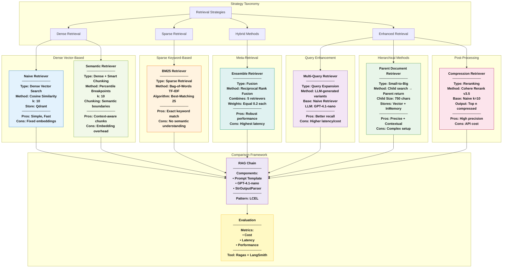

<p align = "center" draggable=”false” >
</p>

## <h1 align="center" id="heading">Advanced Retrieval with LangChain</h1>

### Steps to Run:

1. Run `uv sync`
2. Run through the notebook.

---

## Learning Journey: Sessions 07-09

This repository documents a **three-session progression** building toward advanced RAG evaluation:

### Session 07: Synthetic Data Generation ([session07-sdg-ragas-langsmith.py](session07-sdg-ragas-langsmith.py))

**KnowledgeGraph-Based Test Data Creation:**
- Constructs `KnowledgeGraph` from documents using RAGAS
- Applies `default_transforms` to build semantic relationships
- Generates golden testsets with **weighted query synthesizers**:
  - 50% `SingleHopSpecificQuerySynthesizer` (simple factual queries)
  - 25% `MultiHopAbstractQuerySynthesizer` (reasoning across concepts)
  - 25% `MultiHopSpecificQuerySynthesizer` (multi-document reasoning)
- Exports to LangSmith for evaluation tracking

**Key Pattern:**
```python
kg = KnowledgeGraph()
kg_transform = default_transforms(documents, llm, embedding_model)
apply_transforms(kg, kg_transform)
generator = TestsetGenerator(llm=llm, embedding_model=emb, knowledge_graph=kg)
testset = generator.generate(testset_size=10, query_distribution=[...])
```

### Session 08: Evaluation Framework ([session08-ragas-rag-evals.py](session08-ragas-rag-evals.py))

**LangGraph State-Based RAG Architecture:**
- Implements RAG using **LangGraph** (alternative to LCEL chains)
- State managed via `TypedDict` schemas
- Sequential node execution: `retrieve` → `generate`
- Compares baseline vs. reranked retrieval strategies

**Ragas Evaluation Metrics Suite:**
1. **LLMContextRecall** - Were all ground-truth facts retrieved?
2. **Faithfulness** - Is response grounded in retrieved context?
3. **FactualCorrectness** - Are facts accurate compared to reference?
4. **ResponseRelevancy** - Does response address the query?
5. **ContextEntityRecall** - Are key entities from ground truth retrieved?
6. **NoiseSensitivity** - How robust is the system to irrelevant context?

**Key Pattern:**
```python
class State(TypedDict):
    question: str
    context: List[Document]
    response: str

graph_builder = StateGraph(State).add_sequence([retrieve, generate])
graph = graph_builder.compile()

# Evaluate with comprehensive metrics
evaluate(
    dataset=evaluation_dataset,
    metrics=[LLMContextRecall(), Faithfulness(), ...],
    llm=evaluator_llm
)
```

### Session 09: Advanced Retrieval Strategies ([session09-adv-retrieval.py](session09-adv-retrieval.py))

**LCEL-Based Retrieval Comparison:**
- Implements 7 retrieval strategies with **identical RAG chains**
- Enables fair comparison by isolating retrieval variable
- Uses declarative LCEL chain composition (see diagram below)

**Key Pattern:**
```python
# Same chain pattern, different retrievers
retrieval_chain = (
    {"context": itemgetter("question") | retriever, "question": itemgetter("question")}
    | RunnablePassthrough.assign(context=itemgetter("context"))
    | {"response": rag_prompt | chat_model, "context": itemgetter("context")}
)
```

---

## Retrieval Strategy Patterns

This diagram illustrates the distinct retrieval strategies implemented in the project and their architectural patterns.



### Key Insights

1. **Strategy Diversity**: The project implements 7 distinct retrieval patterns covering dense, sparse, hybrid, and enhanced methods
2. **Comparative Design**: All strategies feed into identical RAG chains, enabling fair performance comparison
3. **Trade-off Spectrum**:
   - **Speed**: BM25 (fastest) → Naive → Ensemble (slowest)
   - **Cost**: Naive (cheapest) → Compression/Multi-Query (most expensive)
   - **Precision**: Compression (highest) → Ensemble → Naive (variable)
4. **Composability**: Ensemble combines 5 strategies, showing meta-retrieval capabilities
5. **Evaluation-Driven**: The architecture is designed for empirical comparison using Ragas metrics and LangSmith observability
6. **Small-to-Big Pattern**: Parent Document Retriever implements a hierarchical retrieval strategy (search granular, return contextual)
7. **Query Expansion**: Multi-Query uses LLM to generate query variants, improving recall through diversity

---

## Implementation Insights

### Retrieval Strategy Characteristics

| Strategy | Type | Latency | Cost | Best Use Case |
|----------|------|---------|------|---------------|
| **Naive** | Dense Vector | Low | Low | Baseline semantic search |
| **BM25** | Sparse Keyword | Lowest | Lowest | Exact keyword matching |
| **Multi-Query** | Query Enhancement | High | High | Improving recall via query expansion |
| **Parent Document** | Hierarchical | Medium | Medium | Precise search with full context |
| **Compression** | Reranking | High | High | Maximizing precision |
| **Ensemble** | Meta-Retrieval | Highest | Highest | Robust performance across query types |
| **Semantic** | Smart Chunking | Medium | Medium | Documents with clear semantic boundaries |

### Architecture Principles

1. **Modularity**: Each retrieval strategy is independently implemented and testable
2. **Composability**: Strategies can be combined (as shown in Ensemble)
3. **Consistency**: Shared LLM, prompt, and evaluation framework across all strategies
4. **Observability**: LangSmith integration for tracing and cost analysis
5. **Extensibility**: New retrieval strategies can be added following the same pattern

### RAG Architecture Patterns

The repository demonstrates **two distinct RAG implementation patterns**, each with different use cases:

#### Pattern 1: LangGraph (State-Based) - Session 08

**When to use:**
- Need explicit state management and checkpointing
- Building multi-step workflows with conditional routing
- Require human-in-the-loop or agent-based patterns
- Want granular control over execution flow

**Architecture:**
```python
# Define state schema
class State(TypedDict):
    question: str
    context: List[Document]
    response: str

# Implement stateful node functions
def retrieve(state):
    retrieved_docs = retriever.invoke(state["question"])
    return {"context": retrieved_docs}

def generate(state):
    docs_content = "\n\n".join(doc.page_content for doc in state["context"])
    messages = rag_prompt.format_messages(question=state["question"], context=docs_content)
    response = llm.invoke(messages)
    return {"response": response.content}

# Build and compile graph
graph_builder = StateGraph(State).add_sequence([retrieve, generate])
graph_builder.add_edge(START, "retrieve")
graph = graph_builder.compile()

# Invoke with state dict
result = graph.invoke({"question": "..."})
```

**Characteristics:**
- Imperative programming style (explicit node functions)
- State passed between nodes via dictionary updates
- Easy to inspect intermediate states
- Supports cycles and complex control flow

#### Pattern 2: LCEL (Declarative Chains) - Session 09

**When to use:**
- Simple linear pipelines (retrieve → augment → generate)
- Want concise, readable chain composition
- Need automatic parallelization and streaming
- Building standard RAG applications

**Architecture:**
```python
# Declarative chain composition
retrieval_chain = (
    # Step 1: Create context and question dict
    {"context": itemgetter("question") | retriever, "question": itemgetter("question")}
    # Step 2: Pass through context unchanged
    | RunnablePassthrough.assign(context=itemgetter("context"))
    # Step 3: Generate response from prompt + LLM
    | {"response": rag_prompt | chat_model, "context": itemgetter("context")}
)

# Invoke with dict input
result = retrieval_chain.invoke({"question": "..."})
```

**Characteristics:**
- Declarative programming style (chain composition with `|`)
- Automatic batching and parallelization
- Built-in streaming support
- Simpler syntax for linear workflows

**Key Difference:**
- **LangGraph**: Think "state machines" - explicit state updates, nodes, edges
- **LCEL**: Think "Unix pipes" - data flows left-to-right through transformations

### Key Files Reference

#### Session 07: Synthetic Data Generation
- **File**: `session07-sdg-ragas-langsmith.py`
- **KnowledgeGraph Construction**: Lines 107-120 (Node creation, transforms)
- **Query Synthesizers**: Lines 128-134 (Weighted distribution: 50/25/25)
- **LangSmith Dataset Creation**: Lines 216-239 (Export golden testset)
- **Evaluation Criteria**: Lines 245-273 (QA, helpfulness, dopeness evaluators)

#### Session 08: RAG Evaluation Framework
- **File**: `session08-ragas-rag-evals.py`
- **LangGraph State Schema**: Lines 157-160 (TypedDict definition)
- **State Functions**: Lines 145-154 (retrieve, generate nodes)
- **Graph Construction**: Lines 163-165, 209-211 (StateGraph with add_sequence)
- **Ragas Metrics**: Lines 38-45 (Import 6 evaluation metrics)
- **Evaluation Execution**: Lines 251-264 (evaluate() with full metrics suite)

#### Session 09: Advanced Retrieval
- **File**: `session09-adv-retrieval.py` / `Advanced_Retrieval_with_LangChain_Assignment.ipynb`
- **Data Loading**: Lines 69-86 (CSV loader with metadata)
- **Vector Stores**: Lines 98-103 (Naive), 112-126 (Semantic), 135-148 (Parent)
- **Retrievers**: Lines 106 (Naive), 166 (BM25), 169-172 (Compression), 175-177 (Multi-Query), 180-185 (Ensemble), 129 (Semantic)
- **LCEL Chains**: Lines 194-198 (Naive), 204-208 (BM25), 214-218 (Compression), 224-228 (Multi-Query), 234-238 (Parent), 244-248 (Ensemble), 254-258 (Semantic)
- **Sample Queries**: Lines 264-324 (Demonstration of each retriever)
