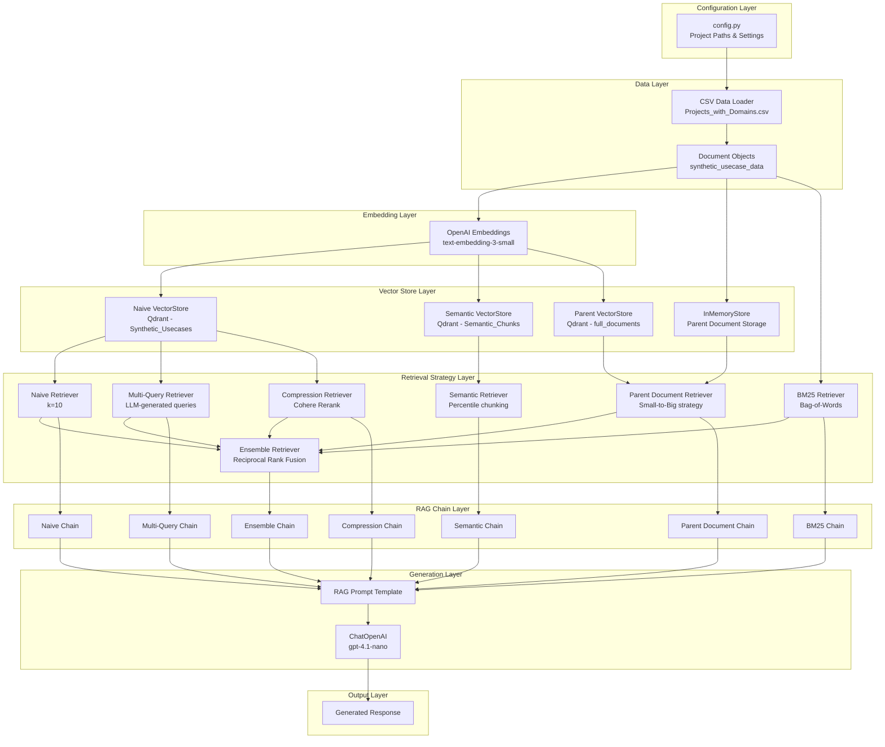
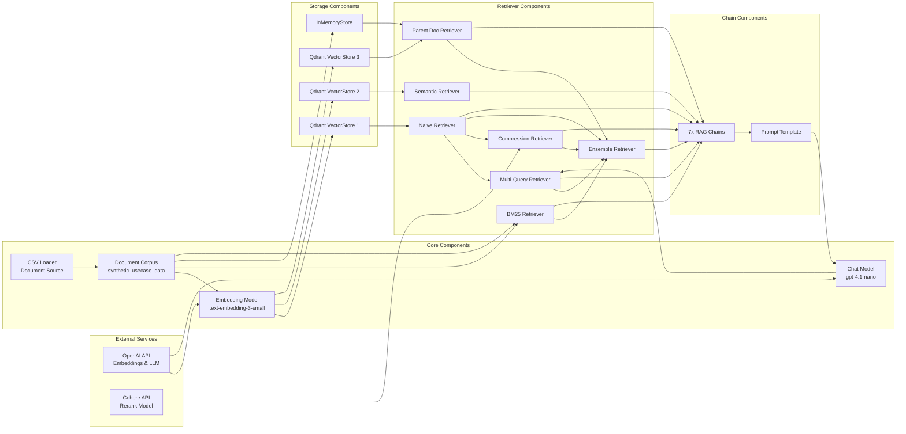
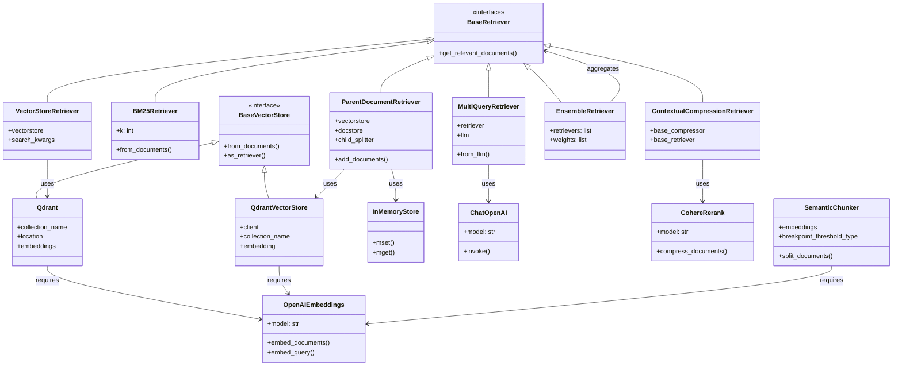
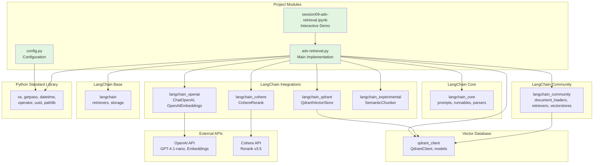
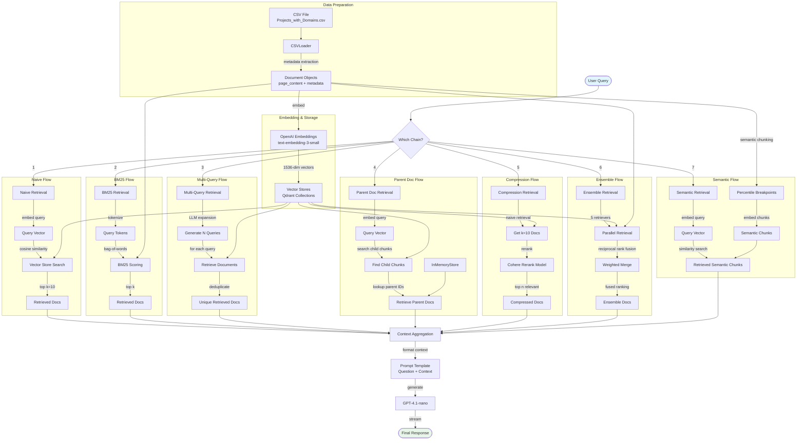
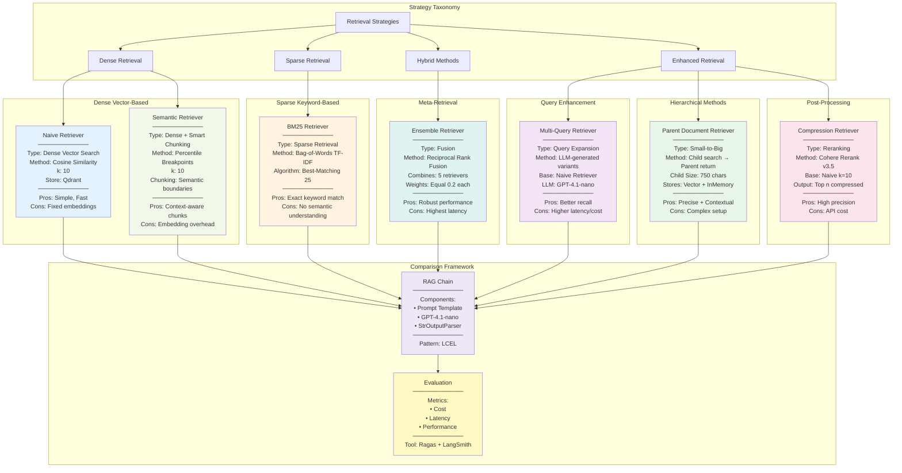

# Architecture Diagrams

## Overview

This document provides comprehensive architecture diagrams for the Advanced Retrieval project (aie8-s09-adv-retrieval). The project focuses on exploring and comparing multiple retrieval strategies for RAG (Retrieval-Augmented Generation) systems using LangChain.

The main codebase consists of:
- **config.py**: Configuration management for paths and settings
- **adv-retrieval.py**: Core retrieval implementation (Jupyter notebook in Python format)
- **notebooks/session09-adv-retrieval.ipynb**: Interactive notebook demonstrating retrieval strategies

The project implements 7 distinct retrieval strategies with a common RAG chain pattern, enabling side-by-side comparison of retrieval performance.

---

## System Architecture

The system follows a layered architecture pattern, organizing functionality from configuration and data loading at the base, through retrieval strategies in the middle, to RAG chains at the top.

### Key Insights

1. **Layered Separation**: Clear separation between data loading, embedding, retrieval, and generation layers enables modularity and testability
2. **Multiple Vector Stores**: The architecture uses 3 distinct Qdrant vector stores optimized for different retrieval strategies (naive, semantic, parent-document)
3. **Shared Components**: All retrieval chains share the same LLM (gpt-4.1-nano) and prompt template, isolating the retrieval strategy as the only variable
4. **Ensemble Pattern**: The Ensemble Retriever acts as a meta-retriever, combining outputs from 5 different retrieval strategies using Reciprocal Rank Fusion

---

## Component Relationships

This diagram shows how the core components interact and their dependencies. The relationships reveal a hub-and-spoke pattern with the document corpus at the center.

### Key Insights

1. **External Dependencies**: The system depends on two external APIs (OpenAI for embeddings/LLM, Cohere for reranking)
2. **Document Hub Pattern**: The document corpus serves as a central hub, feeding into multiple retrieval strategies
3. **Retriever Composition**: Some retrievers are built on top of others (Compression uses Naive, Multi-Query uses Naive, Ensemble uses 5 retrievers)
4. **Storage Diversity**: Different retrieval strategies require different storage mechanisms (3 vector stores + 1 in-memory store)
5. **Chain Uniformity**: All 7 RAG chains use identical prompt templates and LLM configuration, ensuring fair comparison

---

## Class Hierarchies

The project primarily leverages existing LangChain classes rather than defining custom class hierarchies. Below is the class structure showing the imported LangChain components and their relationships.

### Key Insights

1. **No Custom Classes**: The project uses composition of existing LangChain classes rather than inheritance or custom implementations
2. **Retriever Polymorphism**: All retrievers implement the BaseRetriever interface, enabling consistent usage across RAG chains
3. **Strategy Pattern**: Different retriever implementations represent different retrieval strategies, following the Strategy design pattern
4. **Dependency Injection**: Retrievers receive their dependencies (embeddings, LLMs, stores) through constructor injection
5. **Framework-Driven**: The architecture relies heavily on LangChain's framework classes, minimizing custom code

---

## Module Dependencies

This diagram illustrates the dependency relationships between project modules and external packages.

### Key Insights

1. **Minimal Custom Code**: Only 2 Python modules (config.py and adv-retrieval.py) with config having zero external dependencies
2. **Heavy Framework Reliance**: The project depends on 6 different LangChain packages, showing deep integration with the framework
3. **External API Coupling**: Direct dependencies on OpenAI and Cohere APIs through LangChain wrappers
4. **Vector Store Coupling**: Tight coupling to Qdrant as the vector database (used through both langchain_community and langchain_qdrant)
5. **Low Coupling in Config**: config.py only uses Python standard library (pathlib), making it highly portable
6. **Notebook as Consumer**: The Jupyter notebook depends on the main module, suggesting proper code organization

---

## Data Flow

This diagram shows how data flows through the system from initial CSV loading through to final response generation.

### Key Insights

1. **Parallel Strategy Pattern**: 7 independent retrieval flows process the same query in different ways
2. **Common Entry/Exit**: All flows start with a user query and end with the same LLM/prompt, isolating retrieval as the variable
3. **Embedding Duplication**: Naive, Multi-Query, Parent, and Semantic flows all embed the query independently (potential optimization)
4. **Two-Stage Patterns**: Compression (retrieve then rerank) and Parent Document (search children, return parents) use two-stage processing
5. **Data Reuse**: The same document corpus and embeddings are reused across multiple vector stores (memory-efficient)
6. **Context Aggregation**: All retrieved documents flow into a common context aggregation point before LLM generation

---

## Retrieval Strategy Patterns

This diagram illustrates the distinct retrieval strategies implemented in the project and their architectural patterns.

### Key Insights

1. **Strategy Diversity**: The project implements 7 distinct retrieval patterns covering dense, sparse, hybrid, and enhanced methods
2. **Comparative Design**: All strategies feed into identical RAG chains, enabling fair performance comparison
3. **Trade-off Spectrum**:
   - **Speed**: BM25 (fastest) → Naive → Ensemble (slowest)
   - **Cost**: Naive (cheapest) → Compression/Multi-Query (most expensive)
   - **Precision**: Compression (highest) → Ensemble → Naive (variable)
4. **Composability**: Ensemble combines 5 strategies, showing meta-retrieval capabilities
5. **Evaluation-Driven**: The architecture is designed for empirical comparison using Ragas metrics and LangSmith observability
6. **Small-to-Big Pattern**: Parent Document Retriever implements a hierarchical retrieval strategy (search granular, return contextual)
7. **Query Expansion**: Multi-Query uses LLM to generate query variants, improving recall through diversity

---

## Implementation Insights

### Retrieval Strategy Characteristics

| Strategy | Type | Latency | Cost | Best Use Case |
|----------|------|---------|------|---------------|
| **Naive** | Dense Vector | Low | Low | Baseline semantic search |
| **BM25** | Sparse Keyword | Lowest | Lowest | Exact keyword matching |
| **Multi-Query** | Query Enhancement | High | High | Improving recall via query expansion |
| **Parent Document** | Hierarchical | Medium | Medium | Precise search with full context |
| **Compression** | Reranking | High | High | Maximizing precision |
| **Ensemble** | Meta-Retrieval | Highest | Highest | Robust performance across query types |
| **Semantic** | Smart Chunking | Medium | Medium | Documents with clear semantic boundaries |

### Architecture Principles

1. **Modularity**: Each retrieval strategy is independently implemented and testable
2. **Composability**: Strategies can be combined (as shown in Ensemble)
3. **Consistency**: Shared LLM, prompt, and evaluation framework across all strategies
4. **Observability**: LangSmith integration for tracing and cost analysis
5. **Extensibility**: New retrieval strategies can be added following the same pattern

### Key Files Reference

- **Configuration**: `/home/donbr/don-aie-cohort8/aie8-s09-adv-retrieval/config.py` (lines 8-24)
- **Data Loading**: `adv-retrieval.py` (lines 59-80) / `session09-adv-retrieval.ipynb` (cell 5)
- **Vector Stores**: `session09-adv-retrieval.ipynb` (cells 9, 14, 18)
- **Retrievers**: `session09-adv-retrieval.ipynb` (cells 10, 22-25)
- **RAG Chains**: `session09-adv-retrieval.ipynb` (cells 28-40)
- **Evaluation**: `session09-adv-retrieval.ipynb` (cells 41-62)
