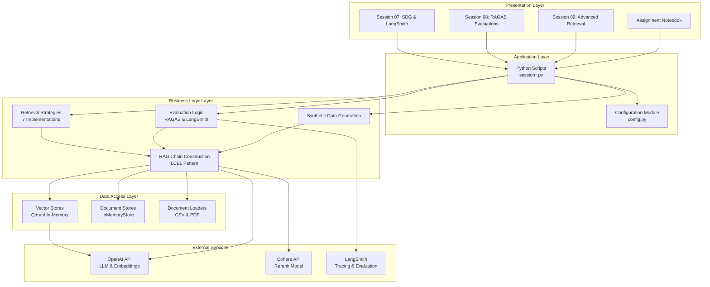
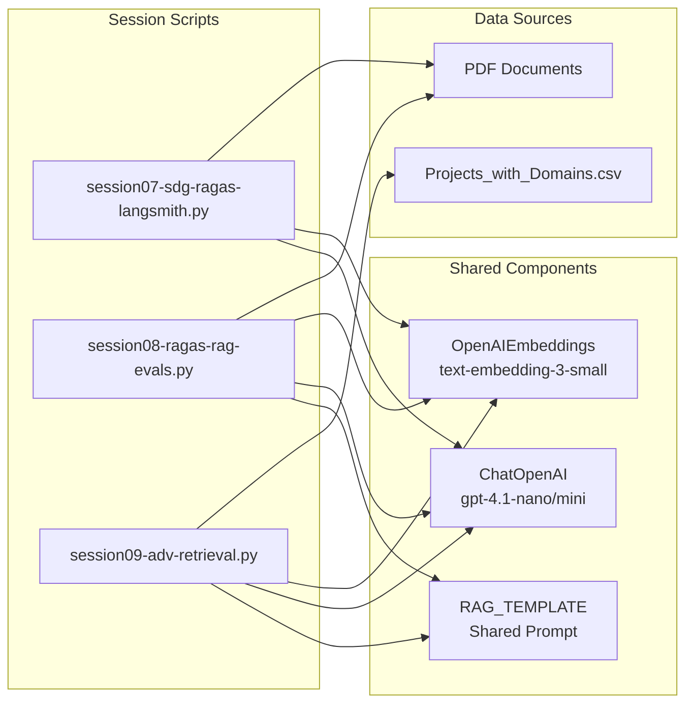
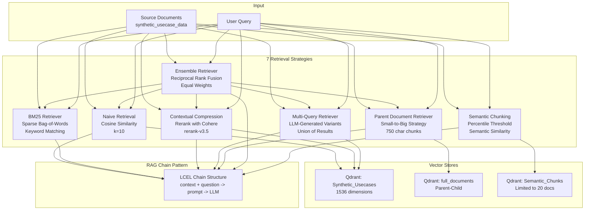
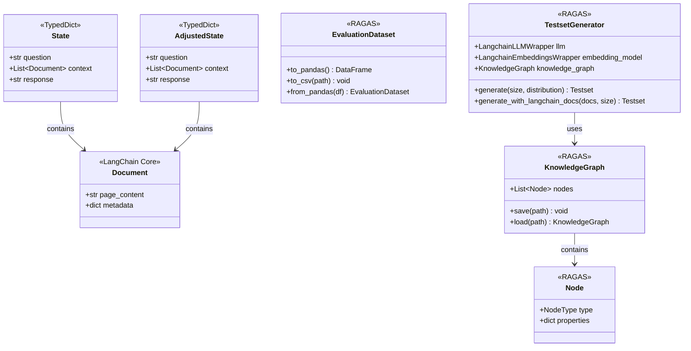
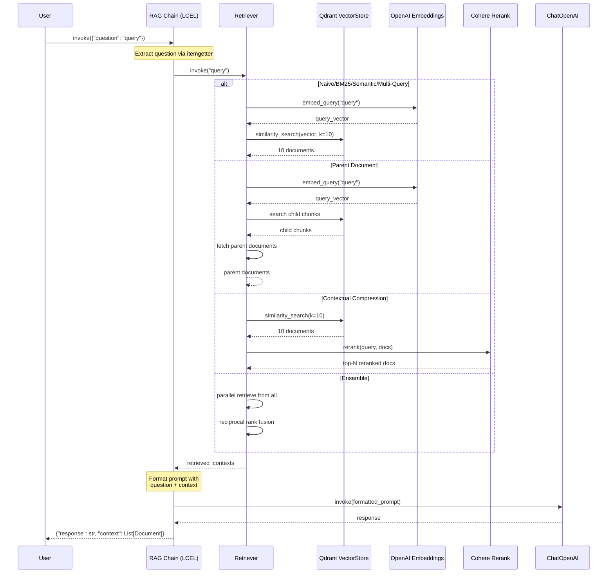
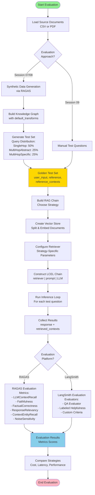

# Architecture Diagrams

## System Architecture

### Layered Architecture

**Description**: This project follows a layered architecture pattern designed for educational exploration of advanced RAG retrieval strategies:

- **Presentation Layer**: Jupyter notebooks organized by session topic (sessions 07-09) providing interactive learning experiences
- **Application Layer**: Python script implementations of each session's concepts plus configuration management
- **Business Logic Layer**: Core RAG functionality including 7 retrieval strategies, evaluation frameworks (RAGAS/LangSmith), synthetic data generation, and LCEL chain patterns
- **Data Access Layer**: Abstraction for vector stores (Qdrant), document stores, and data loaders for CSV and PDF documents
- **External Services**: Integration with OpenAI (GPT-4.1 models, text-embedding-3-small/large), Cohere (rerank-v3.5), and LangSmith for observability

## Component Relationships

### Module Interaction

**Description**: The modules interact through shared components and dependencies:

- **Session Scripts**: Each session script (07-09) is self-contained but follows common patterns
- **Configuration Module**: Provides centralized path management and default settings (chunk sizes, collection names)
- **Data Sources**: CSV data for project domains (sessions 09 & adv-retrieval), PDF documents for evaluation (sessions 07-08)
- **Shared Components**: Common embedding model (text-embedding-3-small), LLM instances (gpt-4.1 variants), and standardized RAG prompt template

### Retrieval Strategy Components

**Description**: The project implements 7 distinct retrieval strategies, each optimized for different scenarios:

1. **Naive Retrieval**: Baseline cosine similarity search returning top-10 documents
2. **BM25**: Classic sparse retrieval using bag-of-words for keyword-based matching
3. **Contextual Compression**: Retrieves 10 docs then reranks using Cohere's rerank-v3.5 model
4. **Multi-Query**: Generates multiple query variations via LLM, retrieves for each, returns union
5. **Parent Document Retriever**: Searches small chunks (750 chars) but returns full parent documents
6. **Ensemble Retriever**: Combines all 5 other retrievers using Reciprocal Rank Fusion with equal weights
7. **Semantic Chunking**: Pre-processing strategy that chunks by semantic similarity (percentile threshold)

All strategies feed into the same LCEL chain pattern for consistent evaluation.

## Class Hierarchies

### State Management Classes

**Description**: The project uses TypedDict classes for state management in LangGraph implementations:

- **State/AdjustedState**: TypedDict classes defining the state schema for RAG graphs (question, context documents, response)
- **Document**: LangChain core document class containing page_content and metadata
- **RAGAS Classes**: Evaluation framework classes for synthetic data generation (TestsetGenerator), knowledge graph construction (KnowledgeGraph, Node), and evaluation datasets (EvaluationDataset)

The state classes follow LangGraph patterns while RAGAS classes support the evaluation pipeline.

## Module Dependencies

### Import Graph

```mermaid
---
id: ca1e1523-9ce8-4c6e-b079-835bfc2cf908
---
graph TB
    subgraph "Session 09: Advanced Retrieval"
        S09[session09-adv-retrieval.py]
    end

    subgraph "Session 08: RAGAS Evals"
        S08[session08-ragas-rag-evals.py]
    end

    subgraph "Session 07: SDG & LangSmith"
        S07[session07-sdg-ragas-langsmith.py]
    end

    subgraph "LangChain Core"
        LC_CORE[langchain_core<br/>prompts, runnables,<br/>output_parsers]
        LC_RETR[langchain.retrievers<br/>Ensemble, Parent,<br/>Multi-Query, Compression]
        LC_SPLIT[langchain_text_splitters<br/>Recursive, Semantic]
    end

    subgraph "LangChain Community"
        LC_COMM[langchain_community<br/>BM25Retriever,<br/>CSVLoader, PDFLoader,<br/>Qdrant VectorStore]
    end

    subgraph "LangChain Integrations"
        LC_OAI[langchain_openai<br/>ChatOpenAI,<br/>OpenAIEmbeddings]
        LC_COH[langchain_cohere<br/>CohereRerank]
        LC_QDRANT[langchain_qdrant<br/>QdrantVectorStore]
    end

    subgraph "LangGraph"
        LG[langgraph.graph<br/>StateGraph, START]
    end

    subgraph "RAGAS_SG"["RAGAS"]
        RAGAS[ragas<br/>evaluate, metrics,<br/>TestsetGenerator,<br/>KnowledgeGraph]
    end

    subgraph "LangSmith"
        LS[langsmith<br/>Client, evaluate,<br/>LangChainStringEvaluator]
    end

    subgraph "Qdrant Client"
        QC[qdrant_client<br/>QdrantClient, models]
    end

    S09 --> LC_CORE
    S09 --> LC_RETR
    S09 --> LC_SPLIT
    S09 --> LC_COMM
    S09 --> LC_OAI
    S09 --> LC_COH
    S09 --> QC

    S08 --> LC_CORE
    S08 --> LC_RETR
    S08 --> LC_COMM
    S08 --> LC_OAI
    S08 --> LC_COH
    S08 --> LC_QDRANT
    S08 --> LG
    S08 --> RAGAS
    S08 --> QC

    S07 --> LC_CORE
    S07 --> LC_COMM
    S07 --> LC_OAI
    S07 --> RAGAS
    S07 --> LS
```

**Description**: The dependency graph shows clear separation of concerns:

- **Config Module**: Provides path configuration but has minimal dependencies (only pathlib)
- **Session 07**: Focuses on synthetic data generation (RAGAS) and evaluation (LangSmith)
- **Session 08**: Adds LangGraph for RAG pipeline orchestration and comprehensive RAGAS metrics
- **Session 09**: Concentrates on retrieval strategies with extensive LangChain retrievers
- **External Dependencies**: OpenAI (LLM & embeddings), Cohere (reranking), Qdrant (vector storage), RAGAS (evaluation), LangSmith (observability)

## Data Flow

### Retrieval Pipeline

**Description**: The retrieval pipeline follows a consistent LCEL pattern across all strategies:

1. **Query Input**: User provides question as dict input
2. **Question Extraction**: LCEL chain extracts question via itemgetter
3. **Retrieval**: Strategy-specific retrieval logic executes:
   - **Vector-based**: Embed query, search vector store, return top-k
   - **Parent Document**: Search child chunks, return parent documents
   - **Compression**: Retrieve candidates, then rerank with Cohere
   - **Ensemble**: Parallel retrieval from multiple strategies, fuse with RRF
4. **Context Assembly**: Retrieved documents assigned to context key
5. **Prompt Formatting**: RAG template populated with question + context
6. **Generation**: LLM generates response based on formatted prompt
7. **Output**: Return both response and context for evaluation

### RAG Evaluation Flow

**Description**: The RAG evaluation workflow supports comprehensive testing and comparison:

1. **Data Loading**: Load source documents (CSV for session 09, PDF for sessions 07-08)

2. **Test Set Generation**:
   - **RAGAS Approach (Sessions 07-08)**: Build knowledge graph, apply transforms, generate synthetic test set with query distribution
   - **Manual Approach (Session 09)**: Use predefined questions for strategy comparison

3. **Golden Test Set**: Contains user_input (question), reference (expected answer), and reference_contexts (ground truth)

4. **RAG Chain Construction**:
   - Select retrieval strategy (1 of 7)
   - Split and embed documents
   - Configure strategy-specific parameters
   - Build LCEL chain pattern

5. **Inference**: Run each test question through the chain, collect response and retrieved contexts

6. **Evaluation Platform Selection**:
   - **RAGAS**: Comprehensive metrics including context recall, faithfulness, factual correctness, response relevancy, entity recall, and noise sensitivity
   - **LangSmith**: Custom evaluators for QA accuracy, helpfulness, and domain-specific criteria

7. **Results Analysis**: Compare strategies across cost (API calls), latency (execution time), and performance (metric scores)

## External Dependencies

### API and Service Integration

```mermaid
graph TB
    subgraph "Project Code"
        SCRIPTS[Python Scripts<br/>session*.py]
        NOTEBOOKS[Jupyter Notebooks<br/>*.ipynb]
    end

    subgraph "OpenAI Services"
        GPT4_NANO[GPT-4.1-nano<br/>Fast Generation<br/>Used in: RAG chains]
        GPT4_MINI[GPT-4.1-mini<br/>Balanced Performance<br/>Used in: Evaluation]
        GPT4[GPT-4.1<br/>High Quality<br/>Used in: SDG, Evaluation]
        EMB_SMALL[text-embedding-3-small<br/>1536 dimensions<br/>Used in: Vector stores]
        EMB_LARGE[text-embedding-3-large<br/>Used in: Session 07]
    end

    subgraph "Cohere Services"
        RERANK[rerank-v3.5<br/>Contextual Compression<br/>Reranking Model]
    end

    subgraph "LangSmith Services"
        LS_TRACE[Tracing & Logging<br/>LANGCHAIN_TRACING_V2]
        LS_EVAL[Evaluation Platform<br/>Dataset Management<br/>Custom Evaluators]
        LS_PROJ[Project Organization<br/>Session-based Projects]
    end

    subgraph "Qdrant"
        QDRANT_MEM[In-Memory Vector Store<br/>Collections:<br/>- Synthetic_Usecases<br/>- full_documents<br/>- Semantic_Chunks<br/>- Use Case RAG]
    end

    subgraph "RAGAS Framework"
        RAGAS_SDG[Synthetic Data Generation<br/>TestsetGenerator]
        RAGAS_METRICS[Evaluation Metrics<br/>6 Core Metrics]
        RAGAS_KG[Knowledge Graph<br/>Transform Pipeline]
    end

    subgraph "Data Sources"
        CSV_DATA[Projects_with_Domains.csv<br/>Project metadata & descriptions]
        PDF_DATA[PDF Documents<br/>Use case documentation]
    end

    SCRIPTS --> GPT4_NANO
    SCRIPTS --> GPT4_MINI
    SCRIPTS --> GPT4
    SCRIPTS --> EMB_SMALL
    NOTEBOOKS --> EMB_LARGE

    SCRIPTS --> RERANK

    SCRIPTS --> LS_TRACE
    SCRIPTS --> LS_EVAL
    SCRIPTS --> LS_PROJ

    SCRIPTS --> QDRANT_MEM

    SCRIPTS --> RAGAS_SDG
    SCRIPTS --> RAGAS_METRICS
    SCRIPTS --> RAGAS_KG

    SCRIPTS --> CSV_DATA
    SCRIPTS --> PDF_DATA

    style GPT4_NANO fill:#74AA9C
    style EMB_SMALL fill:#74AA9C
    style RERANK fill:#D4A5A5
    style LS_TRACE fill:#9B9ECE
    style QDRANT_MEM fill:#FFD93D
    style RAGAS_SDG fill:#95E1D3
    style CSV_DATA fill:#F8B400
```

**Description**: The project integrates with multiple external services and frameworks:

### OpenAI API Integration
- **GPT-4.1-nano**: Lightweight model for RAG response generation in all retrieval chains
- **GPT-4.1-mini**: Mid-tier model for RAGAS evaluations and balanced tasks
- **GPT-4.1**: Premium model for synthetic data generation and high-quality evaluation
- **text-embedding-3-small**: Primary embedding model (1536-dim) for all vector stores
- **text-embedding-3-large**: Alternative embedding model used in session 07

### Cohere API Integration
- **rerank-v3.5**: State-of-the-art reranking model for contextual compression retrieval strategy
- Compresses initial retrieval results to top-N most relevant documents

### LangSmith Integration
- **Tracing**: Automatic logging of all LangChain executions via LANGCHAIN_TRACING_V2
- **Evaluation Platform**: Dataset creation, management, and custom evaluators
- **Project Organization**: Session-based project naming with UUID for isolation

### Qdrant Vector Database
- **In-Memory Collections**: Four distinct collections for different strategies
  - `Synthetic_Usecases`: Main collection for naive/BM25/compression/multi-query
  - `full_documents`: Parent-child structure for parent document retrieval
  - `Semantic_Chunks`: Semantically chunked documents
  - `Use Case RAG`: Collection for session 07-08 evaluations

### RAGAS Framework
- **Synthetic Data Generation**: TestsetGenerator with knowledge graph construction
- **Evaluation Metrics**: 6 core metrics (context recall, faithfulness, factual correctness, response relevancy, entity recall, noise sensitivity)
- **Knowledge Graph**: Document transformation and relationship extraction

### Data Sources
- **CSV Data**: Projects_with_Domains.csv containing project metadata, domains, descriptions, and judge scores
- **PDF Documents**: Use case documentation for evaluation workflows

All external integrations require API keys configured via environment variables (OPENAI_API_KEY, COHERE_API_KEY, LANGCHAIN_API_KEY).
