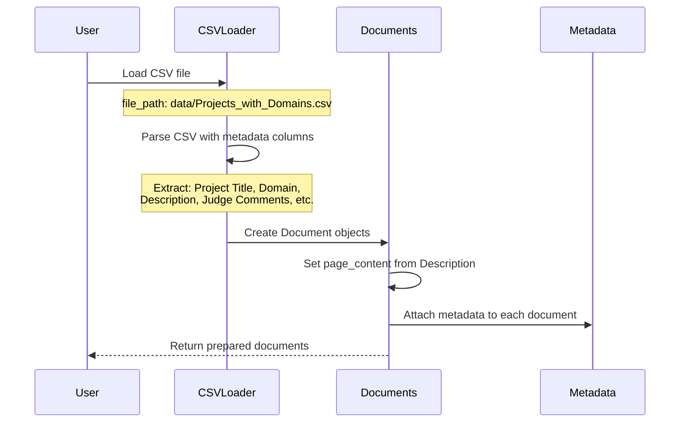
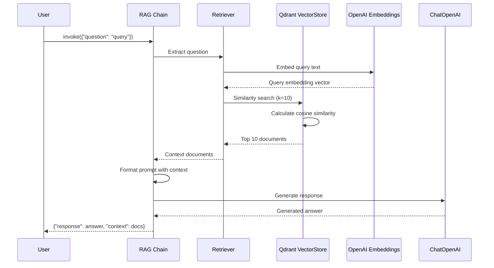
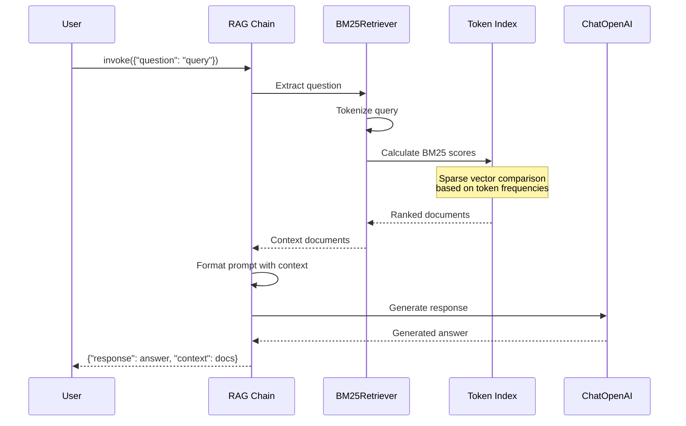
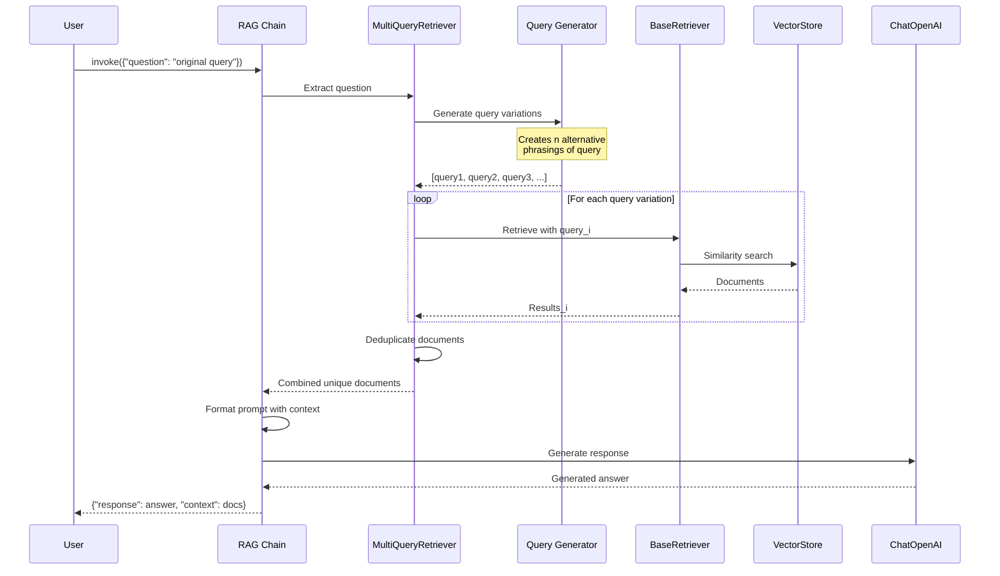
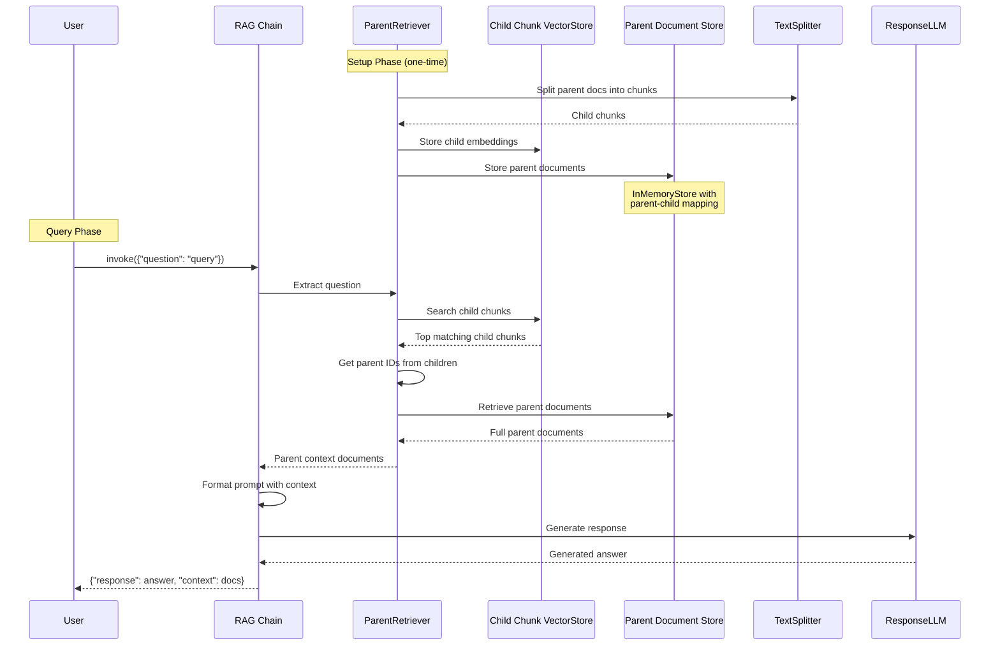
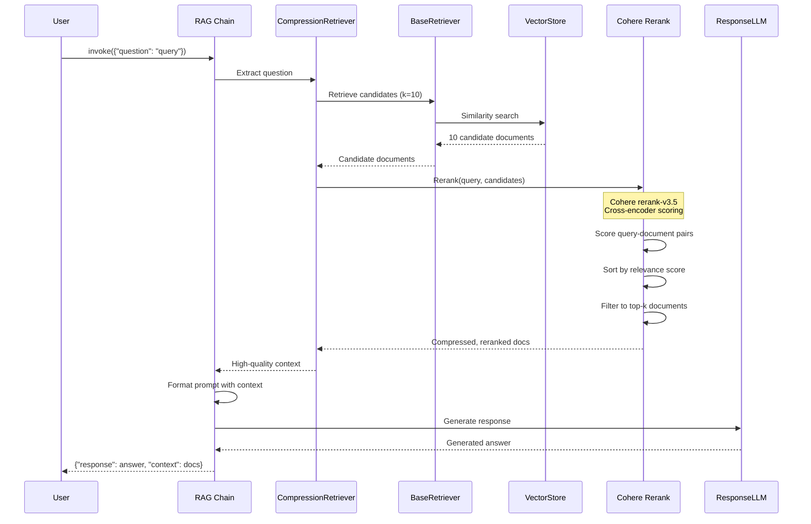
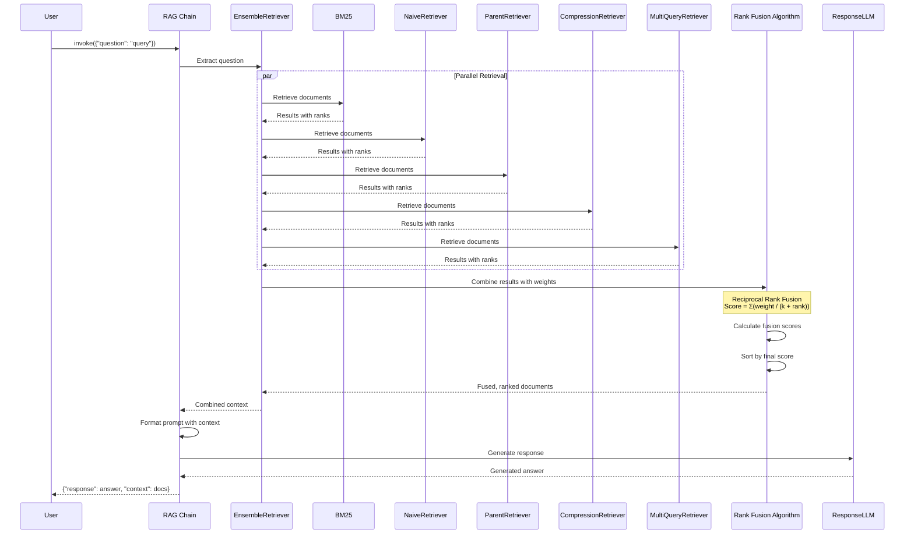
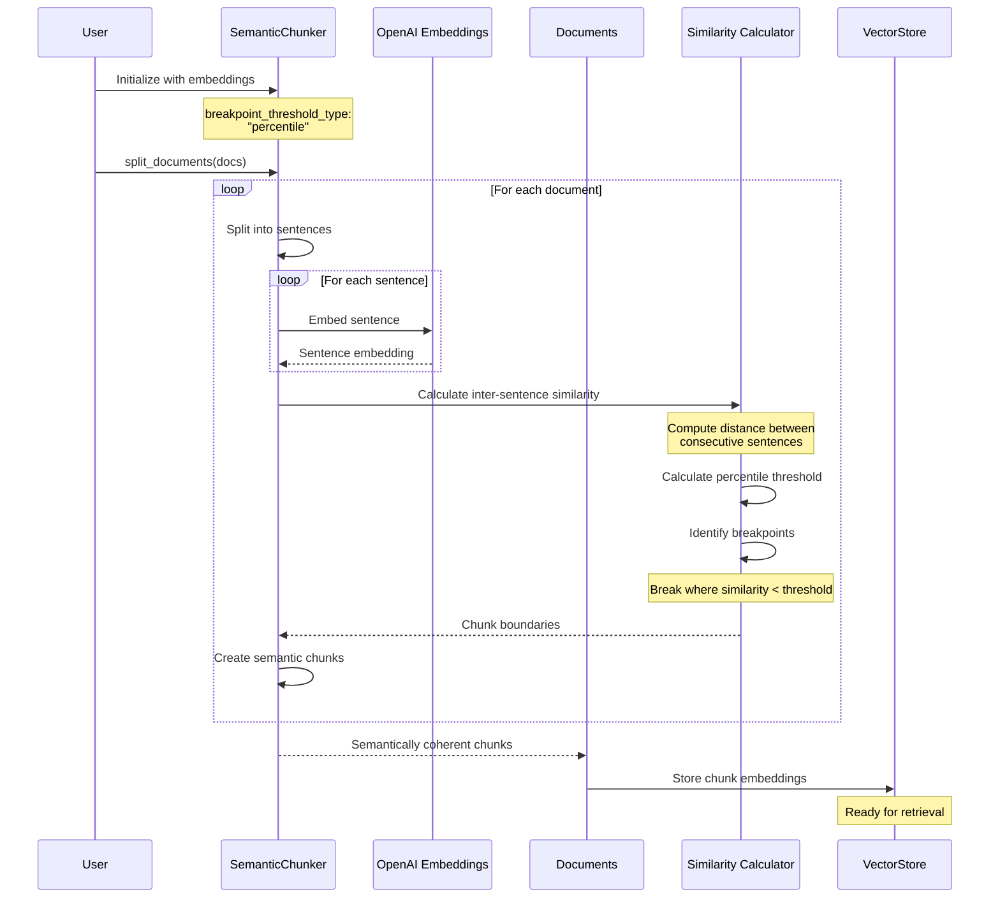
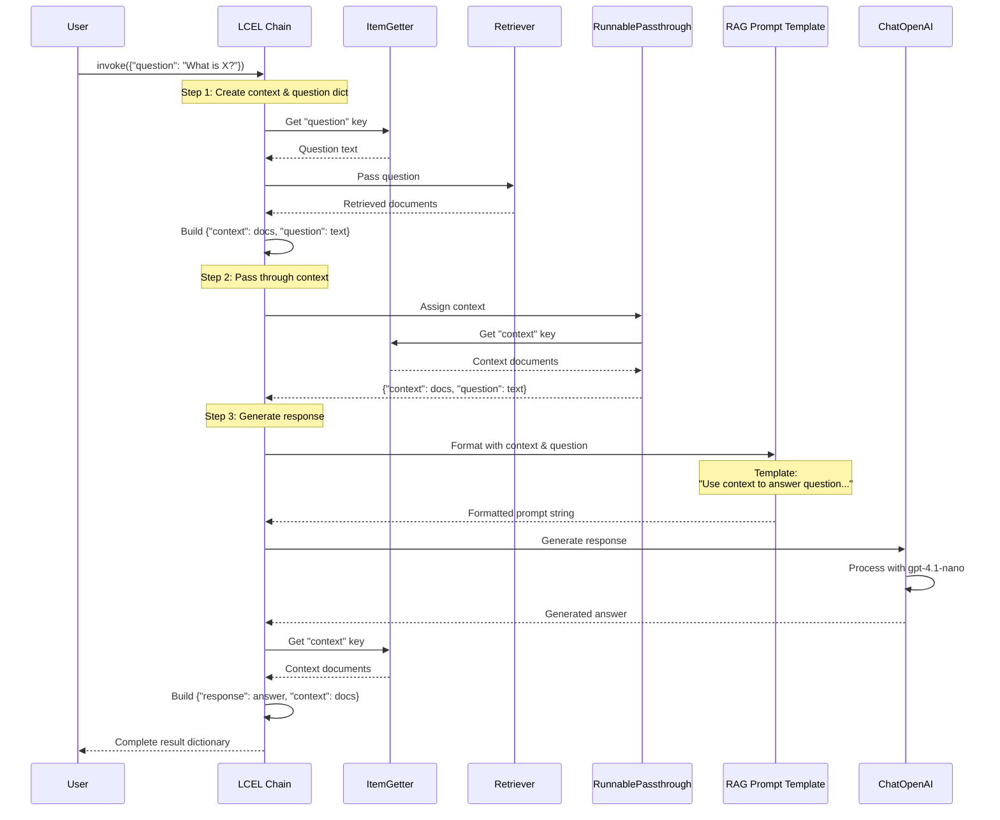

# Data Flow Analysis

## Overview

This document analyzes the actual data flows in the Advanced Retrieval project. The project focuses on comparing seven different RAG (Retrieval-Augmented Generation) retrieval strategies using LangChain. The main data flows involve:

1. Data ingestion from CSV files
2. Document preparation and vectorization
3. Query processing through various retrieval strategies
4. Response generation using LLMs

Unlike typical MCP server or interactive client applications, this project is primarily a research/comparison tool for evaluating retrieval strategies, implemented as both Python scripts and Jupyter notebooks.

---

## Flow 1: Data Ingestion and Preparation Pipeline

### Description
This flow handles loading project data from CSV files, extracting metadata, and preparing documents for vectorization. The data consists of synthetic use case descriptions with metadata about projects, domains, and judge comments.



### Key Steps

1. **CSV Loading** (adv-retrieval-with-langchain.py:69-81)
   - CSVLoader initialized with file path and metadata column specifications
   - Metadata columns include: Project Title, Domain, Secondary Domain, Description, Judge Comments, Score

2. **Document Preparation** (adv-retrieval-with-langchain.py:85-86)
   - Iterate through loaded documents
   - Set page_content to the Description field from metadata
   - Preserve all metadata for filtering and retrieval

3. **Data Structure** (notebooks/session09-adv-retrieval.ipynb:cell-6)
   - Each document contains:
     - page_content: Project description text
     - metadata: Dictionary with all CSV columns

### Implementation Notes

- The CSVLoader is from `langchain_community.document_loaders.csv_loader`
- Documents maintain metadata throughout the pipeline for potential filtering
- The description field is used as the primary content for embedding and retrieval
- This preparation step is common to all retrieval strategies

---

## Flow 2: Naive Vector Retrieval Flow

### Description
The simplest retrieval strategy using cosine similarity between query embeddings and document embeddings stored in a Qdrant vector database.



### Key Steps

1. **Vector Store Setup** (adv-retrieval-with-langchain.py:98-103)
   - Create Qdrant vector store from documents
   - Use OpenAI text-embedding-3-small model
   - Store in memory (":memory:" location)
   - Collection name: "Synthetic_Usecases"

2. **Retriever Configuration** (adv-retrieval-with-langchain.py:106)
   - Convert vector store to retriever
   - Set k=10 to retrieve top 10 documents
   - Uses cosine similarity by default

3. **LCEL Chain Construction** (adv-retrieval-with-langchain.py:194-198)
   - Question extraction using itemgetter
   - Context population via retriever
   - Prompt formatting with RAG template
   - LLM generation with gpt-4.1-nano

4. **Query Execution** (adv-retrieval-with-langchain.py:264)
   - User provides question
   - Chain orchestrates retrieval and generation
   - Returns both response and context

### Implementation Notes

- Qdrant is used for vector storage (in-memory for this demo)
- Embedding dimension: 1536 (for text-embedding-3-small)
- Distance metric: Cosine similarity
- This forms the baseline for comparison with other strategies

---

## Flow 3: BM25 Sparse Retrieval Flow

### Description
Traditional keyword-based retrieval using the BM25 (Best Matching 25) algorithm, which uses bag-of-words representation instead of dense embeddings.



### Key Steps

1. **BM25 Index Creation** (adv-retrieval-with-langchain.py:166)
   - Build BM25 index from documents
   - Create token-based sparse representations
   - No embedding model needed

2. **Query Processing** (adv-retrieval-with-langchain.py:204-208)
   - Tokenize user query
   - Calculate BM25 relevance scores
   - Rank documents by score

3. **Chain Integration** (adv-retrieval-with-langchain.py:204-208)
   - Same LCEL pattern as naive retrieval
   - Only retriever component differs
   - Maintains consistency across strategies

### Implementation Notes

- BM25 is from `langchain_community.retrievers.BM25Retriever`
- Effective for keyword/term matching queries
- No vector database required
- Faster than embedding-based retrieval
- Better for exact term matches

---

## Flow 4: Multi-Query Retrieval Flow

### Description
Generates multiple query variations using an LLM, retrieves documents for each variation, and combines unique results for improved recall.



### Key Steps

1. **Multi-Query Setup** (adv-retrieval-with-langchain.py:175-177)
   - Wrap base naive retriever
   - Provide LLM for query generation
   - Use same chat model (gpt-4.1-nano)

2. **Query Generation** (langchain.retrievers.multi_query)
   - LLM generates multiple query variations
   - Default: 3 alternative queries
   - Captures different ways to ask the same question

3. **Parallel Retrieval** (adv-retrieval-with-langchain.py:224-228)
   - Each query variation retrieves documents
   - Results are combined
   - Duplicates removed based on document ID

4. **Context Aggregation**
   - Unique documents from all queries
   - Increases recall by capturing diverse perspectives
   - May retrieve more documents than single query

### Implementation Notes

- Requires two LLM calls: query generation + response generation
- Increases latency and cost
- Improves recall by reformulating queries
- Effective when user query is ambiguous or narrow
- From `langchain.retrievers.multi_query.MultiQueryRetriever`

---

## Flow 5: Parent Document Retrieval Flow

### Description
A "small-to-big" strategy that searches using small child chunks but returns larger parent documents for better context.



### Key Steps

1. **Vector Store Setup** (adv-retrieval-with-langchain.py:139-148)
   - Create Qdrant client with in-memory storage
   - Create collection for child chunks
   - Vector dimension: 1536, distance: cosine
   - Separate vector store from naive retrieval

2. **Parent Document Configuration** (adv-retrieval-with-langchain.py:135-157)
   - Define parent documents (full synthetic_usecase_data)
   - Create RecursiveCharacterTextSplitter (chunk_size=750)
   - Initialize InMemoryStore for parent storage
   - Create ParentDocumentRetriever linking both stores

3. **Document Addition** (adv-retrieval-with-langchain.py:160)
   - Add parent documents to retriever
   - Automatically splits into child chunks
   - Stores parent-child relationship mappings

4. **Retrieval Process** (adv-retrieval-with-langchain.py:234-238)
   - Query matches against small child chunks
   - Child chunks have focused semantic meaning
   - Parent documents retrieved for full context
   - Better balance of precision and context

### Implementation Notes

- From `langchain.retrievers.ParentDocumentRetriever`
- Requires two storage systems: vector store + docstore
- Child chunks: more precise matching
- Parent docs: complete context for LLM
- Good for documents with natural hierarchical structure
- Chunk size (750) balances specificity and context

---

## Flow 6: Contextual Compression (Reranking) Flow

### Description
Two-stage retrieval: first retrieves many candidate documents, then uses a reranking model to compress to the most relevant subset.



### Key Steps

1. **Compressor Setup** (adv-retrieval-with-langchain.py:169-172)
   - Initialize CohereRerank with model "rerank-v3.5"
   - Wrap naive retriever as base retriever
   - Create ContextualCompressionRetriever

2. **First Stage Retrieval** (Base retriever)
   - Naive retriever gets k=10 candidates
   - Uses cosine similarity on embeddings
   - Broad recall of potentially relevant docs

3. **Reranking Stage** (Cohere API)
   - Send query + candidates to Cohere
   - Cross-encoder model scores query-document pairs
   - More accurate than bi-encoder embeddings
   - Sorts and filters to most relevant documents

4. **Context Compression** (adv-retrieval-with-langchain.py:214-218)
   - Only top reranked documents pass through
   - Higher precision than naive retrieval
   - Reduced noise in context

### Implementation Notes

- From `langchain.retrievers.contextual_compression.ContextualCompressionRetriever`
- Reranker from `langchain_cohere.CohereRerank`
- Two-stage process increases latency and cost
- Rerankers typically more accurate than embeddings alone
- Cross-encoder can compare query-doc directly
- Requires Cohere API key
- Good for improving precision on large candidate sets

---

## Flow 7: Ensemble Retrieval Flow

### Description
Combines multiple retrieval strategies using Reciprocal Rank Fusion (RRF) algorithm to leverage strengths of different approaches.



### Key Steps

1. **Ensemble Configuration** (adv-retrieval-with-langchain.py:180-185)
   - Define retriever list: [BM25, Naive, Parent, Compression, MultiQuery]
   - Calculate equal weights: 1/5 = 0.2 each
   - Initialize EnsembleRetriever with retrievers and weights

2. **Parallel Retrieval** (Ensemble execution)
   - All retrievers execute in parallel
   - Each produces ranked list of documents
   - Independent retrieval strategies

3. **Reciprocal Rank Fusion** (adv-retrieval-with-langchain.py:180-185)
   - RRF algorithm combines rankings
   - Formula: score = Σ(weight_i / (k + rank_i))
   - k is constant (typically 60)
   - Higher scores = more relevant

4. **Result Combination** (adv-retrieval-with-langchain.py:244-248)
   - Documents scored across all retrievers
   - Final ranking based on fusion scores
   - Leverages diverse retrieval approaches

### Implementation Notes

- From `langchain.retrievers.EnsembleRetriever`
- Combines 5 different retrieval strategies
- Equal weighting (can be adjusted based on performance)
- RRF algorithm from "Reciprocal Rank Fusion" paper
- Parallel execution of retrievers
- Most comprehensive but highest latency/cost
- Benefits from diversity of approaches:
  - BM25: keyword matching
  - Naive: semantic similarity
  - Parent: hierarchical context
  - Compression: precision via reranking
  - MultiQuery: improved recall
- Can adjust weights based on evaluation metrics

---

## Flow 8: Semantic Chunking Preparation Flow

### Description
Pre-processing strategy that splits documents based on semantic similarity between sentences rather than fixed character counts.



### Key Steps

1. **Chunker Initialization** (adv-retrieval-with-langchain.py:112-115)
   - Create SemanticChunker with embeddings model
   - Set breakpoint_threshold_type to "percentile"
   - Uses OpenAI text-embedding-3-small

2. **Document Splitting** (adv-retrieval-with-langchain.py:118)
   - Split first 20 documents for demo
   - Analyzes sentence-level semantics
   - Creates variable-length chunks

3. **Similarity Analysis** (SemanticChunker internals)
   - Embed each sentence individually
   - Calculate cosine similarity between consecutive sentences
   - Compute percentile threshold across all similarities
   - Break at points where similarity drops below threshold

4. **Chunk Creation** (SemanticChunker output)
   - Semantically coherent sequences of sentences
   - Variable chunk sizes based on content
   - Preserves semantic boundaries

5. **Vector Store Creation** (adv-retrieval-with-langchain.py:121-126)
   - Create new Qdrant vector store
   - Collection: "Synthetic_Usecase_Data_Semantic_Chunks"
   - Store semantic chunks for retrieval

### Implementation Notes

- From `langchain_experimental.text_splitter.SemanticChunker`
- Four threshold methods available:
  - percentile: Break at high percentile of distances
  - standard_deviation: Break at statistical outliers
  - interquartile: Break based on IQR
  - gradient: Break at sharp similarity changes
- More expensive than character-based splitting (embeds every sentence)
- Better preserves semantic coherence
- Effective for documents with clear topic transitions
- Variable chunk sizes adapt to content structure
- Not a retrieval strategy itself, but enhances retrieval quality

---

## Flow 9: Complete RAG Chain Execution Flow

### Description
The end-to-end flow showing how all components integrate in the LangChain Expression Language (LCEL) pipeline.



### Key Steps

1. **Chain Initialization** (adv-retrieval-with-langchain.py:194-198)
   - Define LCEL pipeline with pipe operator (|)
   - Three main stages: context building, passthrough, generation
   - Same pattern across all retrieval strategies

2. **Context Building Stage** (Line 195)
   ```python
   {"context": itemgetter("question") | retriever, "question": itemgetter("question")}
   ```
   - Extract question from input dict
   - Pass question to retriever
   - Create dict with both context and question

3. **Passthrough Stage** (Line 196)
   ```python
   | RunnablePassthrough.assign(context=itemgetter("context"))
   ```
   - Preserve context for final output
   - Ensures context documents returned to user
   - No transformation, just data flow

4. **Generation Stage** (Line 197)
   ```python
   | {"response": rag_prompt | chat_model, "context": itemgetter("context")}
   ```
   - Format prompt with context and question
   - Send to LLM for generation
   - Build final output dict with response and context

5. **Prompt Template** (adv-retrieval-with-langchain.py:54-66)
   ```
   You are a helpful and kind assistant.
   Use the context provided below to answer the question.

   Query: {question}
   Context: {context}
   ```

### Implementation Notes

- LCEL (LangChain Expression Language) enables declarative chain building
- Pipe operator (|) chains components together
- itemgetter from operator module extracts dict keys
- RunnablePassthrough enables data flow without transformation
- Consistent pattern across all 7 retrieval strategies
- Only retriever component changes between strategies
- ChatOpenAI uses gpt-4.1-nano model
- Returns both response and context for transparency

---

## Summary of Data Flows

### Primary Flows
1. **Data Ingestion**: CSV → Documents → Metadata extraction
2. **Naive Retrieval**: Query → Embeddings → Vector search → Context
3. **BM25 Retrieval**: Query → Tokenization → Sparse matching → Context
4. **Multi-Query**: Query → LLM variations → Multiple retrievals → Merged context
5. **Parent Document**: Query → Child search → Parent retrieval → Full context
6. **Contextual Compression**: Query → Candidates → Reranking → Compressed context
7. **Ensemble**: Query → Multiple retrievers → Rank fusion → Combined context
8. **Semantic Chunking**: Documents → Sentence embeddings → Semantic boundaries → Chunks
9. **RAG Chain**: Question → Retrieval → Prompt → LLM → Response

### Flow Characteristics

| Flow | Complexity | Latency | Cost | Best For |
|------|-----------|---------|------|----------|
| Naive | Low | Low | Low | Baseline semantic search |
| BM25 | Low | Very Low | Very Low | Keyword/term matching |
| Multi-Query | High | High | High | Ambiguous queries, recall |
| Parent Document | Medium | Medium | Medium | Hierarchical documents |
| Contextual Compression | High | High | High | Precision, noise reduction |
| Ensemble | Very High | Very High | Very High | Best overall performance |
| Semantic Chunking | Medium | Medium (setup) | Medium (setup) | Topic-based documents |

### No Interactive Flows Present

This project does NOT implement:
- MCP (Model Context Protocol) server communication
- Interactive client sessions with state management
- Tool permission callbacks
- Message routing systems
- WebSocket or streaming connections

The project is a batch-style comparison framework, not a production chat system.

### Configuration

- Embedding Model: text-embedding-3-small (OpenAI)
- LLM Model: gpt-4.1-nano (OpenAI)
- Reranking Model: rerank-v3.5 (Cohere)
- Vector Database: Qdrant (in-memory)
- Data Source: Projects_with_Domains.csv

### File References

- **Main Implementation**: /home/donbr/don-aie-cohort8/aie8-s09-adv-retrieval/adv-retrieval-with-langchain.py
- **Notebook**: /home/donbr/don-aie-cohort8/aie8-s09-adv-retrieval/notebooks/session09-adv-retrieval.ipynb
- **Configuration**: /home/donbr/don-aie-cohort8/aie8-s09-adv-retrieval/config.py
