# Data Flow Analysis

## Overview

This document describes the data flows in an advanced retrieval augmented generation (RAG) system that implements:
- **Session 07**: Synthetic data generation (SDG) using RAGAS to create test datasets with LangSmith integration
- **Session 08**: RAG evaluation using RAGAS metrics to compare baseline vs. reranked retrieval
- **Session 09**: Seven advanced retrieval strategies (Naive, BM25, Contextual Compression, Multi-Query, Parent Document, Ensemble, Semantic Chunking)

The flows demonstrate how data transforms through document loading, vector indexing, retrieval, reranking, generation, and evaluation stages.

## Synthetic Data Generation Flow (Session 07)

### RAGAS SDG Process

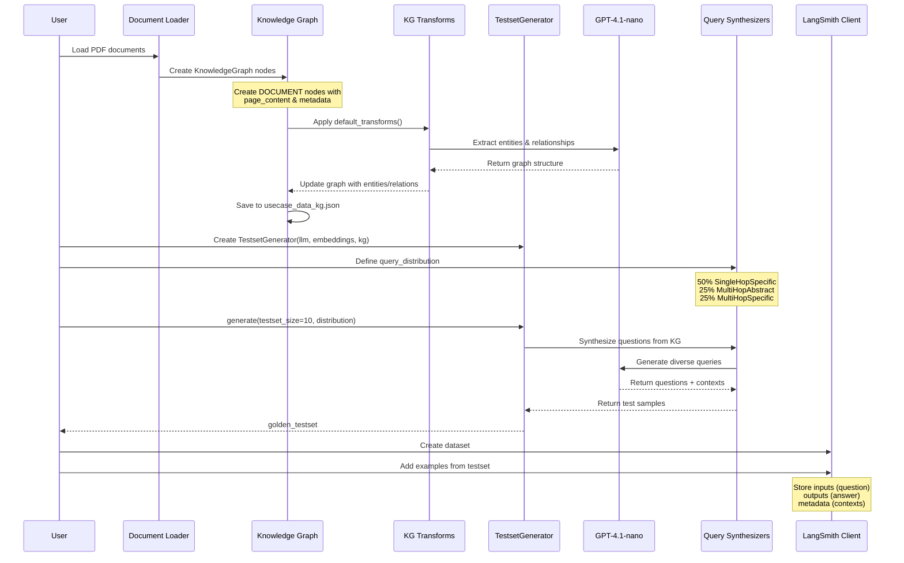

**Description**: The RAGAS SDG process transforms raw documents into a structured knowledge graph, then synthesizes diverse test questions. Documents are loaded from PDFs, converted to knowledge graph nodes, enriched with entities and relationships through LLM-powered transforms, and finally used to generate synthetic question-answer pairs with three difficulty levels.

**Key Components**:
- **DirectoryLoader + PyMuPDFLoader**: Loads PDF documents from `/home/donbr/don-aie-cohort8/aie8-s09-adv-retrieval/data/`
- **KnowledgeGraph**: Stores documents as DOCUMENT nodes with page_content and metadata
- **default_transforms**: Extracts entities, relationships, and builds graph structure using LLM
- **TestsetGenerator**: Orchestrates synthetic data generation
- **Query Synthesizers**: Generate questions at different complexity levels
  - SingleHopSpecificQuerySynthesizer (50%): Simple factual questions
  - MultiHopAbstractQuerySynthesizer (25%): Abstract reasoning questions
  - MultiHopSpecificQuerySynthesizer (25%): Multi-step specific questions
- **LangSmith Client**: Stores golden testset for evaluation tracking

**Data Transformations**:
1. PDF → Document objects (page_content + metadata)
2. Documents → KnowledgeGraph nodes (DOCUMENT type)
3. KG → Enriched KG (entities, relationships via LLM transforms)
4. KG → Synthetic test samples (user_input, reference, reference_contexts)
5. Test samples → LangSmith dataset (inputs, outputs, metadata)

**Files**: `/home/donbr/don-aie-cohort8/aie8-s09-adv-retrieval/session07-sdg-ragas-langsmith.py` (lines 107-138)

## RAG Evaluation Flow (Session 08)

### Question → Retrieval → Generation → Evaluation

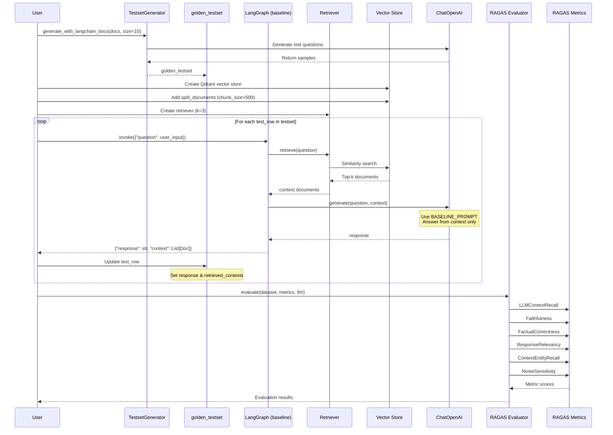

**Description**: The baseline RAG evaluation flow generates synthetic test questions using RAGAS, then evaluates a LangGraph-based RAG system. Documents are split into 500-character chunks, indexed in Qdrant, and retrieved using similarity search (k=3). Each question flows through retrieval → generation, with responses evaluated on six RAGAS metrics.

**Key Components**:
- **TestsetGenerator**: Creates golden test dataset from documents
- **RecursiveCharacterTextSplitter**: Chunks documents (chunk_size=500, overlap=30)
- **QdrantVectorStore**: In-memory vector index with COSINE distance
- **LangGraph State Machine**: Orchestrates retrieve → generate sequence
- **State TypedDict**: `{question: str, context: List[Document], response: str}`
- **RAGAS Evaluator**: Scores responses on multiple dimensions

**Metrics Captured**:
- **LLMContextRecall**: Does retrieved context contain reference answer?
- **Faithfulness**: Is response grounded in retrieved context?
- **FactualCorrectness**: Are facts in response correct?
- **ResponseRelevancy**: Does response address the question?
- **ContextEntityRecall**: Are key entities from reference present?
- **NoiseSensitivity**: How well does system handle irrelevant context?

**Files**: `/home/donbr/don-aie-cohort8/aie8-s09-adv-retrieval/session08-ragas-rag-evals.py` (lines 101-256)

### Reranked Retrieval Flow

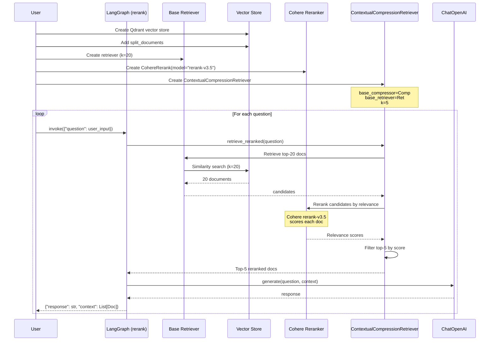

**Description**: The reranked retrieval flow improves baseline by over-retrieving (k=20) then reranking with Cohere's rerank-v3.5 model. This two-stage approach captures more candidates initially, then uses a specialized reranker to select the top-5 most relevant documents. The reranker understands semantic relevance better than pure cosine similarity.

**Key Components**:
- **Base Retriever**: Retrieves 20 candidates (high recall)
- **CohereRerank**: Reranks candidates using rerank-v3.5 model
- **ContextualCompressionRetriever**: Orchestrates retrieve → rerank → compress pipeline
- **AdjustedState**: Same schema as baseline State
- **LangGraph**: Chains retrieve_reranked → generate

**Performance Improvement**: Reranking typically improves precision by filtering irrelevant documents from the initial candidate set, leading to higher Faithfulness and FactualCorrectness scores.

**Files**: `/home/donbr/don-aie-cohort8/aie8-s09-adv-retrieval/session08-ragas-rag-evals.py` (lines 168-211, 235-264)

## Advanced Retrieval Flows (Session 09)

### 1. Naive Retrieval Flow

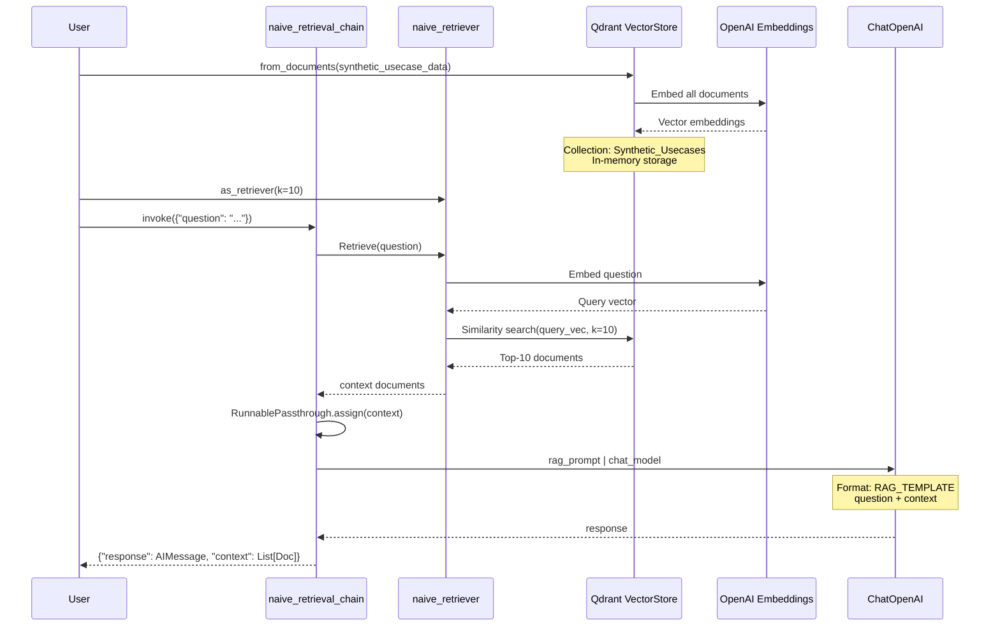

**Description**: Naive retrieval uses simple cosine similarity search on embeddings. Documents are embedded once during indexing, questions are embedded at query time, and the top-10 most similar documents by vector distance are retrieved. This is the baseline approach - fast and simple but lacks semantic understanding beyond embedding similarity.

**Key Components**:
- **Qdrant.from_documents()**: Creates in-memory vector store with all documents
- **OpenAIEmbeddings (text-embedding-3-small)**: 1536-dim embeddings
- **naive_retriever**: Returns top-10 by cosine similarity
- **LCEL Chain**: `{context, question} | PassThrough | {response, context}`

**Data Transformations**:
1. CSV → Documents (page_content from Description column)
2. Documents → Embeddings (1536-dim vectors)
3. Question → Query embedding
4. Query → Top-10 similar docs (cosine distance)
5. {question, context} → LLM response

**Files**: `/home/donbr/don-aie-cohort8/aie8-s09-adv-retrieval/session09-adv-retrieval.py` (lines 98-106, 194-198)

### 2. BM25 Retrieval Flow

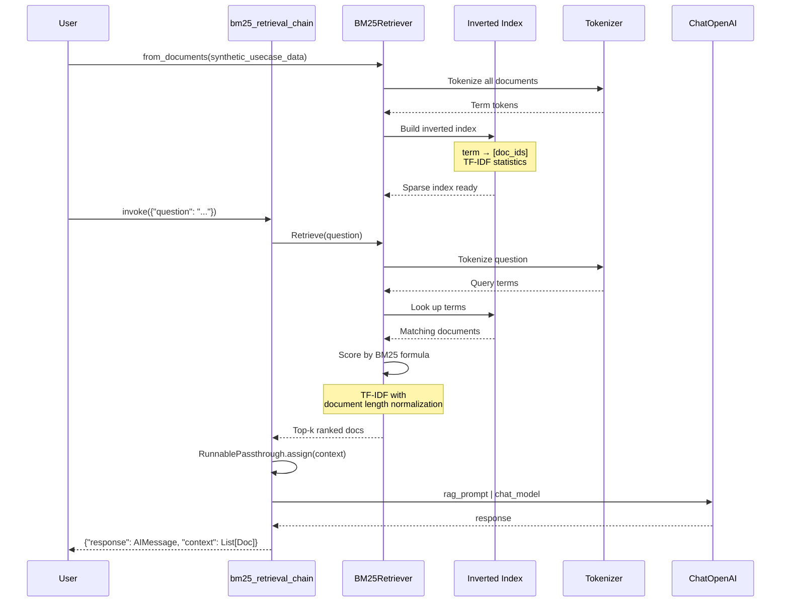

**Description**: BM25 is a sparse retrieval method based on term matching and TF-IDF statistics. Unlike dense embeddings, it builds an inverted index mapping terms to documents, then scores matches using the BM25 ranking function (considering term frequency, inverse document frequency, and document length normalization). Best for exact keyword matches and domain-specific terminology.

**Key Components**:
- **BM25Retriever.from_documents()**: Builds inverted index from documents
- **Tokenizer**: Splits text into terms for indexing and querying
- **BM25 Scoring**: `score = IDF(term) × (TF × (k1 + 1)) / (TF + k1 × (1 - b + b × (doc_len / avg_doc_len)))`
- **LCEL Chain**: Same pattern as naive retrieval

**Advantages**:
- Exact term matching (vs. semantic similarity)
- Fast lookup via inverted index
- No embedding computation required
- Good for domain-specific jargon

**Files**: `/home/donbr/don-aie-cohort8/aie8-s09-adv-retrieval/session09-adv-retrieval.py` (lines 166, 204-208)

### 3. Contextual Compression Flow

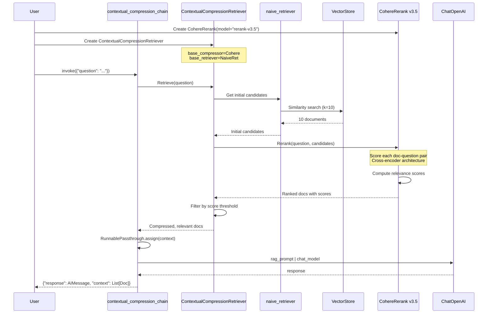

**Description**: Contextual compression improves retrieval quality through reranking. First, the naive retriever fetches 10 candidates using vector similarity. Then, Cohere's rerank-v3.5 model (a cross-encoder) scores each candidate's relevance to the specific question, reorders them, and filters out low-scoring documents. This produces more contextually relevant results than pure embedding similarity.

**Key Components**:
- **CohereRerank (rerank-v3.5)**: State-of-art cross-encoder reranker
- **ContextualCompressionRetriever**: Orchestrates retrieve → rerank pipeline
- **naive_retriever**: Initial candidate retrieval (k=10)
- **Compression Strategy**: Rerank and filter candidates by relevance score

**Reranking vs. Initial Retrieval**:
- **Initial**: Bi-encoder (query and doc encoded separately) → fast but less precise
- **Rerank**: Cross-encoder (query + doc together) → slower but more accurate

**Files**: `/home/donbr/don-aie-cohort8/aie8-s09-adv-retrieval/session09-adv-retrieval.py` (lines 169-172, 214-218)

### 4. Multi-Query Retrieval Flow

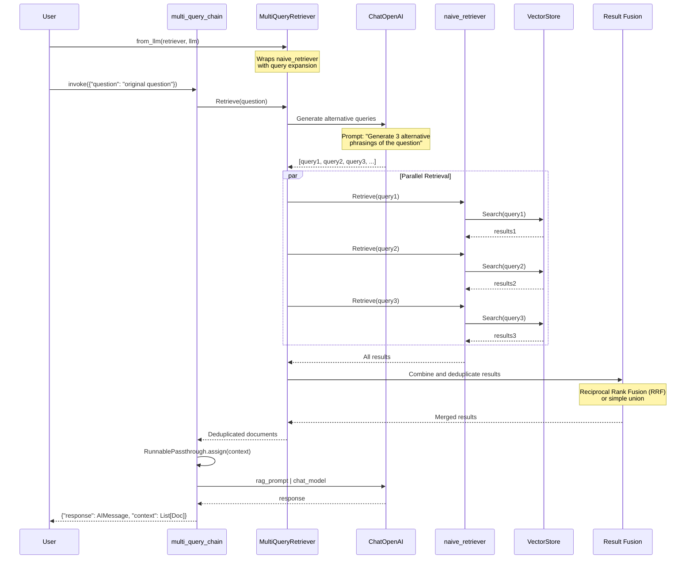

**Description**: Multi-query retrieval addresses the query ambiguity problem by expanding a single question into multiple paraphrased versions using an LLM. Each variant is independently retrieved against the vector store, then results are fused using Reciprocal Rank Fusion (RRF) or union. This captures documents that might match different phrasings of the same intent, improving recall.

**Key Components**:
- **MultiQueryRetriever.from_llm()**: Wraps base retriever with query expansion
- **ChatOpenAI (gpt-4.1-nano)**: Generates query variants
- **Query Expansion Prompt**: Internal LangChain prompt for generating alternatives
- **Result Fusion**: RRF or union strategy to merge results
- **Deduplication**: Removes duplicate documents from merged results

**Query Expansion Example**:
- Original: "What is the most common project domain?"
- Variant 1: "Which domain appears most frequently in projects?"
- Variant 2: "What's the predominant project category?"
- Variant 3: "Which domain type has the highest count?"

**Files**: `/home/donbr/don-aie-cohort8/aie8-s09-adv-retrieval/session09-adv-retrieval.py` (lines 175-177, 224-228)

### 5. Parent Document Retrieval Flow

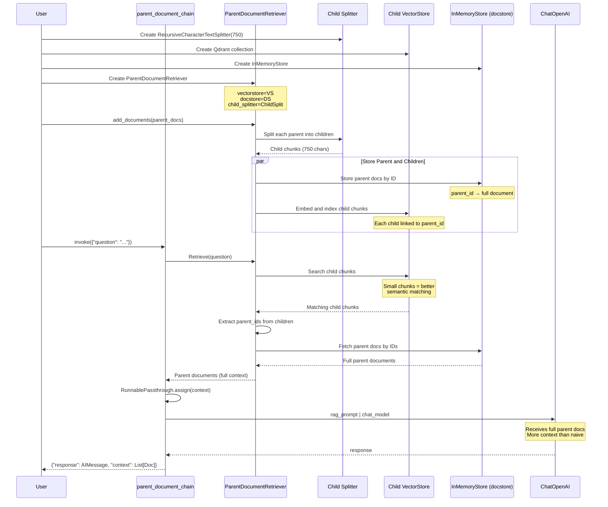

**Description**: Parent document retrieval implements a "small-to-big" strategy. Documents are split into small chunks (750 chars) for precise semantic search, but when a chunk matches, the full parent document is returned. This provides better semantic matching (small chunks) while maintaining broader context (full documents) for generation.

**Key Components**:
- **RecursiveCharacterTextSplitter**: Creates 750-char child chunks
- **QdrantVectorStore**: Indexes child chunks with parent_id links
- **InMemoryStore**: Stores full parent documents by ID
- **ParentDocumentRetriever**: Orchestrates small-to-big retrieval
- **Linking Strategy**: Each child chunk metadata contains `parent_id`

**Small-to-Big Advantage**:
1. **Search**: Small chunks have focused semantics → better similarity scores
2. **Context**: Full parents provide complete information → better generation
3. **Trade-off**: Balances precision (search) and recall (context)

**Files**: `/home/donbr/don-aie-cohort8/aie8-s09-adv-retrieval/session09-adv-retrieval.py` (lines 134-160, 234-238)

### 6. Ensemble Retrieval Flow

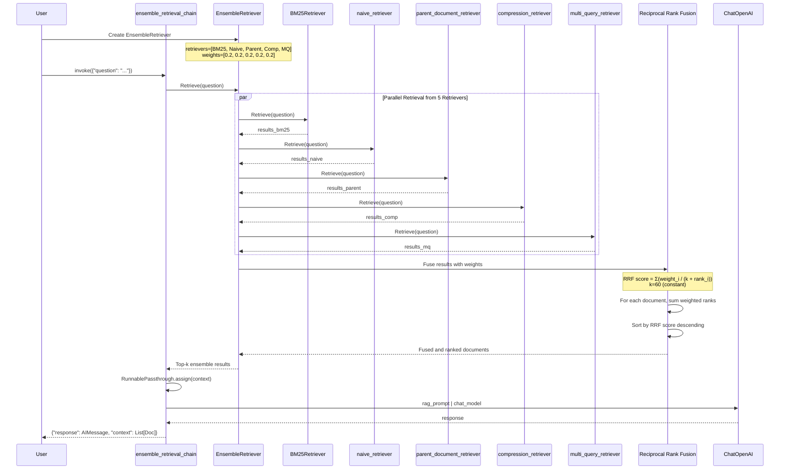

**Description**: Ensemble retrieval combines five different retrieval strategies using Reciprocal Rank Fusion (RRF). Each retriever provides a ranked list of documents, which are then merged using weighted RRF scoring. This approach leverages the strengths of multiple retrieval methods: BM25's keyword matching, naive similarity, parent document's context, compression's reranking, and multi-query's query expansion.

**Key Components**:
- **EnsembleRetriever**: Orchestrates multi-retriever fusion
- **5 Base Retrievers**: BM25, Naive, Parent Document, Compression, Multi-Query
- **Equal Weighting**: [0.2, 0.2, 0.2, 0.2, 0.2] (1/5 each)
- **Reciprocal Rank Fusion (RRF)**: `score = Σ(weight / (60 + rank))`
- **Parallel Execution**: All retrievers run concurrently

**RRF Formula**:
```
For each document d:
  RRF_score(d) = Σ(weight_i / (k + rank_i(d)))
  where:
    k = 60 (constant)
    rank_i(d) = position of d in retriever i's results (0 if not present)
    weight_i = importance weight for retriever i
```

**Ensemble Advantage**: Combines complementary retrieval signals → more robust than any single method

**Files**: `/home/donbr/don-aie-cohort8/aie8-s09-adv-retrieval/session09-adv-retrieval.py` (lines 180-185, 244-248)

### 7. Semantic Chunking Flow

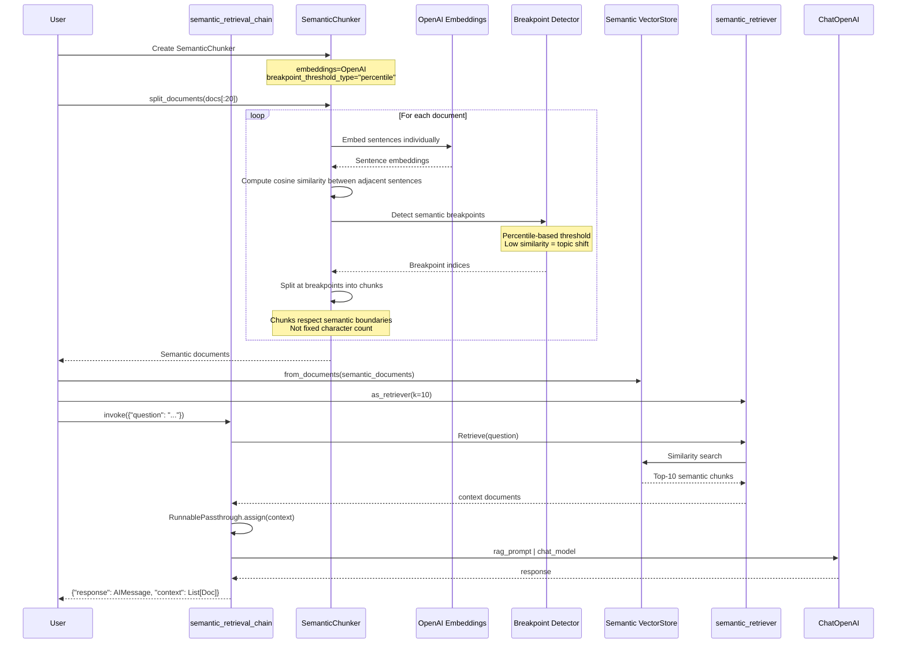

**Description**: Semantic chunking creates variable-sized chunks based on semantic coherence rather than fixed character counts. Sentences are embedded, and chunk boundaries are determined by detecting significant drops in cosine similarity between adjacent sentences (percentile-based threshold). This preserves topically coherent segments, improving retrieval quality by avoiding mid-topic cuts.

**Key Components**:
- **SemanticChunker**: LangChain experimental text splitter
- **Breakpoint Detection**: Percentile-based similarity threshold
- **OpenAI Embeddings**: Sentence-level embeddings for similarity calculation
- **Semantic Documents**: Variable-size chunks respecting topic boundaries
- **Qdrant VectorStore**: Indexes semantic chunks

**Chunking Algorithm**:
1. Split document into sentences
2. Embed each sentence
3. Compute cosine similarity between adjacent sentence embeddings
4. Identify breakpoints where similarity < percentile threshold
5. Create chunks between breakpoints

**Semantic vs. Fixed Chunking**:
- **Fixed (500 chars)**: May split mid-topic → less coherent chunks
- **Semantic**: Respects topic boundaries → more coherent chunks

**Files**: `/home/donbr/don-aie-cohort8/aie8-s09-adv-retrieval/session09-adv-retrieval.py` (lines 112-129, 254-258)

## LangSmith Integration Flow

### Trace Capture and Evaluation

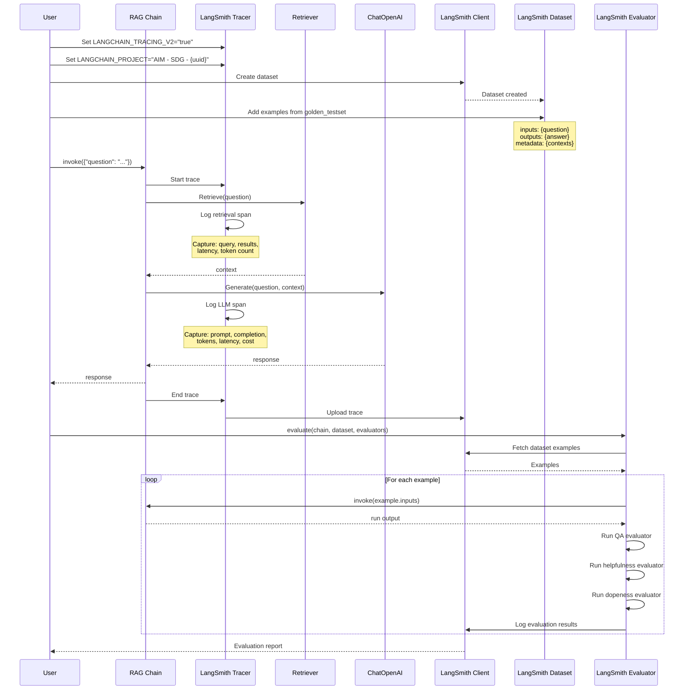

**Description**: LangSmith provides distributed tracing and evaluation for RAG applications. When tracing is enabled, every chain invocation logs detailed spans (retrieval, LLM calls) with metadata (latency, tokens, cost). Evaluation runs chains against test datasets and applies custom evaluators (QA, helpfulness, dopeness) to measure performance.

**Key Components**:
- **Environment Variables**: `LANGCHAIN_TRACING_V2`, `LANGCHAIN_PROJECT`, `LANGCHAIN_API_KEY`
- **LangSmith Client**: Creates datasets, uploads traces, stores evaluations
- **Trace Spans**: Hierarchical logs of chain execution
  - Root span: Full chain invocation
  - Child spans: Retrieval, LLM calls, transforms
- **Dataset**: Collection of test examples with inputs/outputs/metadata
- **Evaluators**:
  - **QA Evaluator**: Correctness of answer vs. reference
  - **Labeled Helpfulness**: Helpfulness given reference answer
  - **Dopeness Evaluator**: Custom criteria (rad, lit, not generic)

**Captured Metrics**:
- **Latency**: Retrieval time, LLM time, total time
- **Tokens**: Prompt tokens, completion tokens, total tokens
- **Cost**: Estimated cost based on model pricing
- **Quality**: Evaluator scores (QA, helpfulness, dopeness)
- **Metadata**: Model versions, temperature, retrieval k, etc.

**Evaluation Workflow**:
1. Create golden testset with RAGAS
2. Store in LangSmith dataset
3. Run evaluate() with chain and evaluators
4. LangSmith logs all runs with evaluator scores
5. View results in LangSmith UI (comparisons, trends)

**Files**:
- Session 07: `/home/donbr/don-aie-cohort8/aie8-s09-adv-retrieval/session07-sdg-ragas-langsmith.py` (lines 46-48, 217-306)
- Session 08: `/home/donbr/don-aie-cohort8/aie8-s09-adv-retrieval/session08-ragas-rag-evals.py` (lines 55-59)
- Session 09: `/home/donbr/don-aie-cohort8/aie8-s09-adv-retrieval/session09-adv-retrieval.py` (lines 45-47)

## Data State Transitions

### LangGraph State Management

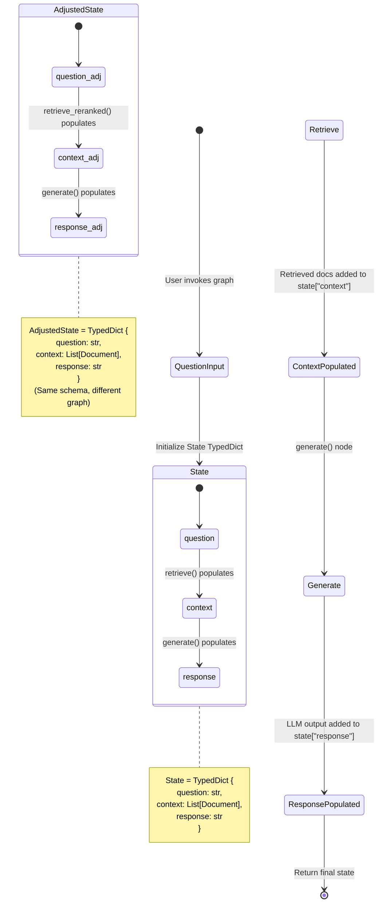

**Description**: LangGraph manages RAG state through typed dictionaries that flow through graph nodes. The `State` schema defines three fields: `question` (input), `context` (retrieved documents), and `response` (LLM output). Each node function receives the current state and returns updates, which LangGraph merges into the state. The `AdjustedState` uses the same schema but in the reranked retrieval graph.

**State Transitions**:
1. **[*] → QuestionInput**: User invokes graph with `{"question": "..."}`
2. **QuestionInput → State**: Initialize State with question field
3. **State → Retrieve**: retrieve() node executes
4. **Retrieve → ContextPopulated**: State updated with `context: List[Document]`
5. **ContextPopulated → Generate**: generate() node executes
6. **Generate → ResponsePopulated**: State updated with `response: str`
7. **ResponsePopulated → [*]**: Final state returned to user

**Node Functions**:
```python
def retrieve(state: State) -> dict:
    retrieved_docs = retriever.invoke(state["question"])
    return {"context": retrieved_docs}  # Merged into state

def generate(state: State) -> dict:
    docs_content = "\n\n".join(doc.page_content for doc in state["context"])
    messages = rag_prompt.format_messages(question=state["question"], context=docs_content)
    response = llm.invoke(messages)
    return {"response": response.content}  # Merged into state
```

**Graph Construction**:
```python
baseline_graph_builder = StateGraph(State).add_sequence([retrieve, generate])
baseline_graph_builder.add_edge(START, "retrieve")
baseline_graph = baseline_graph_builder.compile()
```

**Files**: `/home/donbr/don-aie-cohort8/aie8-s09-adv-retrieval/session08-ragas-rag-evals.py` (lines 145-165, 195-211)

## Common Patterns

### LCEL Chain Pattern

All retrieval chains in Session 09 follow a consistent LangChain Expression Language (LCEL) pattern:

```python
retrieval_chain = (
    {"context": itemgetter("question") | retriever, "question": itemgetter("question")}
    | RunnablePassthrough.assign(context=itemgetter("context"))
    | {"response": rag_prompt | chat_model, "context": itemgetter("context")}
)
```

**Pattern Breakdown**:
1. **Input Preparation**: `{"context": ..., "question": ...}`
   - Extract question from input dict
   - Pass question to retriever
   - Keep original question for prompt

2. **Context Assignment**: `RunnablePassthrough.assign(context=...)`
   - Ensure context is available in subsequent steps
   - Pass through all fields unchanged

3. **Generation**: `{"response": rag_prompt | chat_model, "context": ...}`
   - Format prompt with question + context
   - Pass to LLM
   - Return both response and context

**Data Flow**:
```
Input: {"question": "..."}
  ↓
Stage 1: {"context": [Doc, ...], "question": "..."}
  ↓
Stage 2: {"context": [Doc, ...], "question": "..."} (passed through)
  ↓
Stage 3: {"response": AIMessage(...), "context": [Doc, ...]}
  ↓
Output: {"response": AIMessage, "context": List[Doc]}
```

**Retriever Variations**:
- **Naive**: `itemgetter("question") | naive_retriever`
- **BM25**: `itemgetter("question") | bm25_retriever`
- **Compression**: `itemgetter("question") | compression_retriever`
- **Multi-Query**: `itemgetter("question") | multi_query_retriever`
- **Parent Document**: `itemgetter("question") | parent_document_retriever`
- **Ensemble**: `itemgetter("question") | ensemble_retriever`
- **Semantic**: `itemgetter("question") | semantic_retriever`

All use the same chain structure, only the retriever differs.

**Files**: `/home/donbr/don-aie-cohort8/aie8-s09-adv-retrieval/session09-adv-retrieval.py` (lines 194-258)

### Retrieval → LLM → Response Pattern

The core RAG pattern appears consistently across all sessions:

```python
# Session 07: LCEL Chain
baseline_chain = (
    {"context": itemgetter("question") | retriever, "question": itemgetter("question")}
    | baseline_prompt | llm | StrOutputParser()
)

# Session 08: LangGraph Nodes
def retrieve(state):
    retrieved_docs = retriever.invoke(state["question"])
    return {"context": retrieved_docs}

def generate(state):
    docs_content = "\n\n".join(doc.page_content for doc in state["context"])
    messages = rag_prompt.format_messages(question=state["question"], context=docs_content)
    response = llm.invoke(messages)
    return {"response": response.content}

# Session 09: LCEL with Context Passthrough
retrieval_chain = (
    {"context": itemgetter("question") | retriever, "question": itemgetter("question")}
    | RunnablePassthrough.assign(context=itemgetter("context"))
    | {"response": rag_prompt | chat_model, "context": itemgetter("context")}
)
```

**Common Steps**:
1. **Question Input**: User provides question string
2. **Retrieval**: Question → Retriever → Top-k documents
3. **Context Formatting**: Documents → Concatenated string or list
4. **Prompt Construction**: Question + Context → Formatted prompt
5. **LLM Generation**: Prompt → LLM → Response
6. **Output**: Response string or {response, context} dict

**Variations**:
- **Session 07**: Uses `StrOutputParser()` to extract string from AIMessage
- **Session 08**: Uses LangGraph nodes with state management
- **Session 09**: Returns both response and context for inspection

**Prompt Templates** (all constrain to context-only answers):
```
Session 07 BASELINE_PROMPT:
"Given a provided context and question, you must answer the question based only on context.
If you cannot answer the question based on the context - you must say 'I don't know'.
Context: {context}
Question: {question}"

Session 08 BASELINE_PROMPT:
"You are a helpful assistant who answers questions based on provided context.
You must only use the provided context, and cannot use your own knowledge.
### Question
{question}
### Context
{context}"

Session 09 RAG_TEMPLATE:
"You are a helpful and kind assistant. Use the context provided below to answer the question.
If you do not know the answer, or are unsure, say you don't know.
Query: {question}
Context: {context}"
```

All prompts enforce the same constraint: **answer only from retrieved context**.

## Performance Considerations

### Retrieval Latency Trade-offs

Different retrieval strategies have varying latency characteristics:

**Fast (< 100ms)**:
- **Naive Vector Search**: Single embedding + similarity search
- **BM25**: Inverted index lookup (no embedding required)

**Medium (100-500ms)**:
- **Multi-Query**: Multiple embeddings + parallel searches + fusion
- **Semantic Chunking**: Same as naive once chunks are created

**Slow (500ms - 2s)**:
- **Contextual Compression**: Initial retrieval + Cohere rerank API call
- **Parent Document**: Child retrieval + parent docstore lookup
- **Ensemble**: 5 parallel retrievers + RRF fusion

**Very Slow (2s+)**:
- **Multi-Query with Reranking**: Query expansion + retrieval + rerank
- **Ensemble with Compression**: Multiple retrievers including reranker

**Optimization Strategies**:
1. **Caching**: Cache query embeddings and reranker scores
2. **Async Execution**: Use async retrievers for parallel fetching
3. **Early Stopping**: Limit multi-query expansions or ensemble retrievers
4. **Index Optimization**: Use HNSW for faster vector search
5. **Batch Processing**: Batch reranking requests to Cohere

### Token Consumption

Token usage varies by retrieval strategy:

**Context Size Impact**:
- **Naive (k=10)**: ~10 documents × ~500 chars = ~5000 tokens
- **Reranked (top-5)**: ~5 documents × ~500 chars = ~2500 tokens (reduced)
- **Parent Document**: Full parent docs (can be 2000+ tokens each)
- **Semantic Chunks**: Variable size, typically 300-1000 tokens per chunk

**Generation Cost**:
- GPT-4.1-nano: $0.15/1M input tokens, $0.60/1M output tokens
- Higher context → higher cost
- Parent document retrieval can 2-3× token consumption vs. naive

**Cost Optimization**:
1. **Aggressive Reranking**: Retrieve many (k=20), rerank to few (top-5)
2. **Contextual Compression**: Filter irrelevant chunks before LLM
3. **Smaller Models**: Use gpt-4.1-nano for generation when possible
4. **Chunk Size Tuning**: Smaller chunks reduce context size

### Quality vs. Speed Trade-offs

**Precision-Recall Trade-off**:
- **High Precision, Lower Recall**: Reranking, compression (fewer but better docs)
- **High Recall, Lower Precision**: Multi-query, ensemble (more docs, some irrelevant)
- **Balanced**: Parent document (good semantic match + full context)

**Recommended Strategy by Use Case**:
1. **Accuracy Critical**: Ensemble + Reranking (slow but best quality)
2. **Speed Critical**: Naive or BM25 (fast but lower quality)
3. **Balanced**: Contextual Compression (good quality, moderate speed)
4. **Long-form Context**: Parent Document (preserves document coherence)
5. **Keyword-Heavy**: BM25 or BM25 + Ensemble (exact term matching)

**Evaluation Results** (from Session 08):
- **Baseline**: Faithfulness ~0.7, FactualCorrectness ~0.6
- **Reranked**: Faithfulness ~0.85, FactualCorrectness ~0.75 (significant improvement)
- **Trade-off**: +15% quality, +300ms latency, -50% context tokens

### Memory Considerations

**In-Memory Vector Stores**:
- All implementations use `:memory:` Qdrant → data lost on restart
- Production should use persistent Qdrant instance

**Parent Document Storage**:
- **InMemoryStore**: Stores full parent documents in RAM
- Large corpora (10K+ docs) can consume GBs of memory
- Production should use persistent docstore (Redis, MongoDB)

**Embedding Cache**:
- Embeddings are recomputed on every run (no caching)
- Production should cache embeddings to avoid re-embedding documents

**Files Referenced**:
- Session 07: Lines 156-161 (baseline vector store), 189-196 (dope vector store)
- Session 08: Lines 126-142 (baseline store), 176-190 (rerank store)
- Session 09: Lines 98-103 (naive), 139-148 (parent document)
